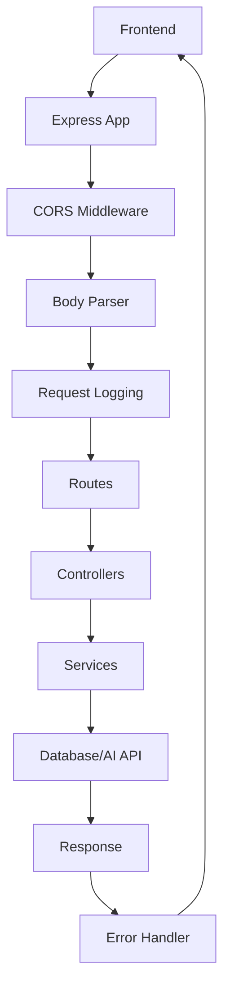

# 🚀 Backend 구조 가이드

> Node.js + Express + Supabase 기반의 포춘쿠키 AI 상담 API 서버

---

## 📋 목차
1. [🔄 테스트/운영 설정 전환 가이드](#-테스트운영-설정-전환-가이드) ⚡
2. [프로젝트 개요](#-프로젝트-개요)
3. [폴더 구조](#-폴더-구조)
4. [핵심 설정](#️-핵심-설정)
5. [API 엔드포인트](#-api-엔드포인트)
6. [서비스별 상세 분석](#-서비스별-상세-분석)
7. [데이터베이스](#-데이터베이스)
8. [일일 사용 제한 시스템](#-일일-사용-제한-시스템)
9. [개발 & 운영](#-개발--운영)

---

## 🔄 테스트/운영 설정 전환 가이드

### 📍 **현재 상태** (운영용 - 최종 업데이트)
- ✅ **일일 사용 제한**: **운영용 (24시간 제한)** - 매일 자정(00:00)까지 대기
- ✅ **로그 자동 삭제**: **운영용 (어제 이전 모든 로그 삭제)** - 매일 00:02 실행
- ✅ **스케줄러**: **운영용 (매일 00:02 로그 삭제, 1시간마다 재가입 제한 정리)**

### 🏭 **운영용 설정 (현재 활성화됨)**

#### 📂 **변경된 파일 목록**
1. `backend/src/services/accessControlService.js`
2. `backend/src/services/dailyUsageLogService.js`
3. `backend/src/utils/scheduler.js`

#### ✅ **운영용 설정 내용**

**1. 일일 사용 제한 체크 (24시간)**
- 📂 `backend/src/services/accessControlService.js` (221-255줄)
  - 운영용 코드 활성화: 오늘 날짜(00:00 ~ 23:59) 기준으로 체크
  - 테스트용 코드 주석 처리됨

- 📂 `backend/src/services/dailyUsageLogService.js` (59-75줄)
  - 운영용 코드 활성화: 오늘 날짜 기준 체크
  - 테스트용 코드 주석 처리됨

**2. 다음 이용 가능 시간 계산 (자정까지)**
- 📂 `backend/src/services/accessControlService.js` (301-326줄)
  - 운영용: 자정(00:00:00)까지 남은 시간 계산
  - 테스트용 코드 주석 처리됨

**3. 로그 자동 삭제 (어제 이전 모든 로그 삭제)**
- 📂 `backend/src/utils/scheduler.js` (116-152줄)
  - 운영용 함수 활성화: 어제 이전의 모든 로그 삭제 (서버 재시작 시 누락된 로그도 정리)
  - 테스트용 함수 주석 처리됨

**4. 스케줄러 (매일 00:02 로그 삭제, 1시간마다 재가입 제한 정리)**
- 📂 `backend/src/utils/scheduler.js` (180-252줄)
  - 운영용: 매일 00:02에 어제 이전의 모든 로그 삭제
  - 운영용: 1시간마다 재가입 제한 정리
  - 테스트용 함수 주석 처리됨

### 🚀 **테스트용으로 전환하기**

#### 1️⃣ **일일 사용 제한을 1분으로 변경**

**📂 `backend/src/services/accessControlService.js` (192-255줄)**
```javascript
// 운영용 코드 주석 처리
// === 운영용: 24시간 제한 (운영시 활성화) ===
// let data, error, count;
// ...

// 테스트용 코드 주석 해제
// === 테스트용: 1분 제한 (테스트시 주석 해제 필요) ===
let data, error, count;
const now = new Date();
const oneMinuteAgo = new Date(now.getTime() - 1 * 60 * 1000);
// ...
```

**📂 `backend/src/services/dailyUsageLogService.js` (49-75줄)**
```javascript
// 운영용 코드 주석 처리
// === 운영용: 24시간 제한 (운영시 활성화) ===
// const today = new Date();
// ...

// 테스트용 코드 주석 해제
// === 테스트용: 1분 제한 (테스트시 주석 해제 필요) ===
const now = new Date();
const oneMinuteAgo = new Date(now.getTime() - 1 * 60 * 1000);
// ...
```

#### 2️⃣ **다음 이용 가능 시간 계산을 1분으로 변경**

**📂 `backend/src/services/accessControlService.js` (278-326줄)**
```javascript
// 운영용 코드 주석 처리
// === 운영용: 24시간 후 시간 계산 (운영시 활성화) ===
// const tomorrow = new Date(lastUsedAt);
// ...

// 테스트용 코드 주석 해제
// === 테스트용: 1분 후 시간 계산 (테스트시 주석 해제 필요) ===
const oneMinuteAfter = new Date(lastUsedAt.getTime() + 1 * 60 * 1000);
// ...
```

#### 3️⃣ **로그 삭제를 1분으로 변경**

**📂 `backend/src/utils/scheduler.js` (37-97줄)**
```javascript
// 운영용 함수 주석 처리
// === 운영용: 24시간 이전 로그 삭제 (운영시 활성화) ===
// export const cleanupOldUsageLogs = async () => {
// ...

// 테스트용 함수 주석 해제
// === 테스트용: 1분 이전 로그 삭제 (테스트시 주석 해제 필요) ===
export const cleanupOldUsageLogs = async () => {
  const minutesToKeep = 1;
  // ...
```

#### 4️⃣ **스케줄러 빈도를 30초로 변경**

**📂 `backend/src/utils/scheduler.js` (130-178줄)**
```javascript
// 운영용 함수 주석 처리
// === 운영용: 1시간마다 실행 (운영시 활성화) ===
// export const startScheduler = () => {
// ...

// 테스트용 함수 주석 해제
// === 테스트용: 30초마다 실행 (테스트시 주석 해제 필요) ===
export const startScheduler = () => {
  setInterval(async () => {
    await cleanupExpiredData();
  }, 30000); // 30초마다 실행
  // ...
```

### ⚡ **빠른 체크리스트**

**운영용 확인:**
- [x] `accessControlService.js` - 운영용 24시간 제한 활성화 ✅
- [x] `dailyUsageLogService.js` - 운영용 24시간 제한 활성화 ✅
- [x] `scheduler.js` - 운영용 어제 이전 모든 로그 삭제 활성화 (매일 00:02) ✅
- [x] `scheduler.js` - 운영용 스케줄러 활성화 (매일 00:02 로그 삭제, 1시간마다 재가입 제한 정리) ✅

**테스트용으로 전환 시:**
- [ ] `accessControlService.js` - 테스트용 1분 제한 주석 해제
- [ ] `dailyUsageLogService.js` - 테스트용 1분 제한 주석 해제
- [ ] `scheduler.js` - 테스트용 1분 삭제 주석 해제
- [ ] `scheduler.js` - 테스트용 30초 스케줄러 주석 해제
- [ ] 서버 재시작 후 로그 확인

---

## 🎯 프로젝트 개요

**Backend**는 포춘쿠키 AI 상담 서비스의 REST API 서버입니다.
- **기술 스택**: Node.js 18+ + Express 5 + Supabase
- **AI 연동**: OpenAI GPT-4 API
- **아키텍처**: MVC 패턴 + 서비스 레이어
- **배포**: 포트 4000에서 실행 (기본값)

---

## 📁 폴더 구조

```
backend/
├─ 📄 설정 파일들
│  ├─ package.json          # 의존성 관리
│  ├─ .env (.env.example)   # 환경변수 설정
│  ├─ index.js              # 구버전 단일파일 (레거시)
│  └─ REFACTORING_SUMMARY.md # 리팩토링 보고서
│
└─ src/ (리팩토링된 구조)
   ├─ 🚀 앱 엔트리
   │  ├─ server.js          # 서버 시작점
   │  └─ app.js             # Express 앱 설정
   │
   ├─ ⚙️ 설정
   │  ├─ config/
   │  │  ├─ index.js        # 전체 설정 통합
   │  │  ├─ database.js     # Supabase 연결 설정
   │  │  └─ create_deletion_restrictions_table.sql  # DB 새로 만들 때 이 SQL 실행
   │
   ├─ 🛣️ 라우팅
   │  ├─ routes/
   │  │  ├─ index.js        # 메인 라우터
   │  │  ├─ authRoutes.js   # 인증 라우트
   │  │  └─ concernRoutes.js # 고민 상담 라우트
   │
   ├─ 🎮 컨트롤러
   │  ├─ controllers/
   │  │  ├─ authController.js    # 인증 요청 처리
   │  │  └─ concernController.js # 고민 상담 요청 처리
   │
   ├─ 🏢 서비스
   │  ├─ services/
   │  │  ├─ authService.js      # 인증 비즈니스 로직
   │  │  ├─ concernService.js   # 상담 비즈니스 로직
   │  │  └─ aiService.js        # AI 연동 서비스
   │
   ├─ 🛡️ 미들웨어
   │  ├─ middleware/
   │  │  ├─ index.js        # 미들웨어 통합
   │  │  ├─ cors.js         # CORS 설정
   │  │  └─ logging.js      # 요청/응답 로깅
   │
   └─ 🔧 유틸리티
      ├─ utils/
      │  ├─ errors.js       # 에러 처리
      │  ├─ logger.js       # 로깅 시스템
      │  └─ validation.js   # 입력값 검증
```

---

## ⚙️ 핵심 설정

### 📦 `package.json`
- **Node.js 18+** + Express 5 기반
- **주요 의존성**: Express, Supabase, Axios, CORS, dotenv
- **스크립트**: 
  - `dev`: `node --watch src/server.js` (개발모드)
  - `start`: `node src/server.js` (운영모드)

### 🌍 환경변수 (`.env`)
```bash
# 서버 설정
PORT=4000
NODE_ENV=development
FRONTEND_URL=http://localhost:3000

# Supabase 설정
SUPABASE_URL=your-supabase-url
SUPABASE_ANON_KEY=your-anon-key  
SUPABASE_SERVICE_ROLE_KEY=your-service-role-key

# OpenAI API
OPENAI_API_KEY=your-openai-api-key
```

### 🚀 서버 시작 (`server.js`)
- **포트**: 4000 (기본값)
- **Graceful Shutdown**: SIGTERM/SIGINT 핸들링
- **로깅**: 구조화된 로그 출력
- **헬스체크**: 데이터베이스 연결 확인

---

## 🛣️ API 엔드포인트

### 기본 구조
```
Base URL: http://localhost:4000/api
```

### 📊 헬스체크
```http
GET /api/health
```
**응답**:
```json
{
  "status": "OK",
  "timestamp": "2025-09-24T10:30:00Z",
  "uptime": 3600
}
```

### 🔐 인증 관련 (`/api/auth`)
```http
POST /api/auth/kakao            # 카카오 로그인
POST /api/auth/kakao/callback   # 카카오 인가 코드 처리
POST /api/auth/sync-user        # 사용자 정보 동기화
POST /api/auth/logout           # 로그아웃
POST /api/auth/delete-account   # 회원탈퇴
GET  /api/auth/profile          # 사용자 프로필 조회
PUT  /api/auth/profile          # 사용자 프로필 업데이트
```

### 💭 고민 상담 관련 (`/api/concerns`)
```http
POST   /api/concerns/ai/both    # AI 답변 생성 (긴 조언만)
POST   /api/concerns/save       # 상담 기록 저장
GET    /api/concerns/           # 본인 상담 기록 조회
PATCH  /api/concerns/:id/save   # 상담 기록 저장 상태 업데이트
PUT    /api/concerns/:id        # 상담 기록 업데이트 (비슷한 고민으로 새 운세)
DELETE /api/concerns/:id        # 특정 상담 기록 삭제
```

### 📝 변경 사항: 짧은 조언(shortAdvice) 제거 (2025-10-30)

- 사유: 프런트엔드에서 짧은 조언을 사용하지 않아 OpenAI 토큰 소모를 방지
- 적용 파일/위치:
  - `backend/src/services/aiService.js`
    - `generateShortAdvice` 메서드 전체 주석 처리 (원본 30-43줄)
    - `generateBothAdvices`에서 `shortAdvice` 필드 제거

```30:47:backend/src/services/aiService.js
/*
// [비활성화됨] 짧은 조언 생성 (포춘쿠키)
static async generateShortAdvice(persona, concern) {
  ... // 전체 메서드 주석 처리됨
}
*/
```

```132:137:backend/src/services/aiService.js
static async generateBothAdvices(persona, concern, randomFortune = null) {
  // 짧은 조언은 비활성화되었습니다. 긴 조언만 생성합니다.
  const longAdvice = await this.generateLongAdvice(persona, concern, randomFortune);
  // const shortAdvice = ''; // [비활성화됨] 짧은 조언은 사용하지 않습니다.
  return { longAdvice };
}
```

- API 응답 영향:
  - `POST /api/concerns/ai/both`의 응답에서 `shortAdvice` 필드가 제거되었습니다.

---

## 🏢 서비스별 상세 분석

### 🤖 **AI Service** (`aiService.js`)

**📍 역할**: OpenAI GPT-4와의 연동  
**📊 규모**: 138줄  
**🎯 핵심**: 포춘쿠키 스타일 AI 긴 조언 생성

#### 주요 기능
```javascript
class AIService {
  static async generateLongAdvice(persona, concern, randomFortune) {
    // GPT-4 호출
    // 긴 조언 생성 (300~450자)
    // persona별 맞춤 조언
  }
  
  static async generateBothAdvices(persona, concern, randomFortune) {
    // 긴 조언만 생성 (shortAdvice 제거됨)
    return { longAdvice };
  }
}
```

#### AI 프롬프트 설정
- **시스템 역할**: persona별 맞춤 조언자
- **답변 길이**: 300~450자 내외
- **톤앤매너**: 따뜻하고 재치 있는 조언
- **구성**: 포춘 쿠키 해석 + 실천 3가지 + 마지막 응원

### 💭 **Concern Service** (`concernService.js`)

**📍 역할**: 상담 기록 CRUD 처리  
**📊 규모**: Supabase 연동  
**🗄️ 테이블**: `ai_answers`

#### 데이터 스키마
```sql
ai_answers {
  id: UUID (Primary Key)
  user_id: UUID (Foreign Key)
  persona: TEXT
  concern: TEXT  
  ai_response: TEXT
  created_at: TIMESTAMP
}
```

#### 주요 기능
- ✅ **저장**: 상담 기록 DB 저장
- ✅ **조회**: 사용자별 기록 조회
- ✅ **삭제**: 개별 기록 삭제
- ✅ **필터링**: 날짜/역할별 필터 지원

### 🔐 **Auth Service** (`authService.js`)

**📍 역할**: Supabase 인증 처리  
**📊 규모**: JWT 토큰 검증  
**🔑 방식**: Supabase Auth

#### 주요 기능
- ✅ **토큰 검증**: JWT 토큰 유효성 확인
- ✅ **사용자 정보**: Supabase에서 사용자 데이터 조회
- ✅ **권한 확인**: API 접근 권한 검증

---

## 🎮 컨트롤러 계층

### 📝 **Concern Controller**
```javascript
class ConcernController {
  // AI 답변 생성 (짧은+긴)
  static async generateBothAdvices(req, res, next)
  
  // 상담 기록 저장  
  static async saveConcern(req, res, next)
  
  // 본인 상담 기록 조회
  static async getConcerns(req, res, next)
  
  // 상담 기록 저장 상태 업데이트
  static async updateConcernSaveStatus(req, res, next)
  
  // 상담 기록 업데이트 (비슷한 고민으로 새 운세)
  static async updateConcern(req, res, next)
  
  // 기록 삭제
  static async deleteConcern(req, res, next)
}
```

#### 입력 검증
- **필수 필드**: persona, concern, userId 등
- **데이터 타입**: UUID, 문자열 길이 검증
- **에러 핸들링**: 400/401/500 상태코드 처리

### 🔐 **Auth Controller**
```javascript
class AuthController {
  // 카카오 로그인
  static async kakaoLogin(req, res, next)
  
  // 카카오 인가 코드 처리
  static async kakaoCallback(req, res, next)
  
  // 사용자 정보 동기화
  static async syncUser(req, res, next)
  
  // 로그아웃
  static async logout(req, res, next)
  
  // 회원탈퇴
  static async deleteAccount(req, res, next)
  
  // 프로필 조회
  static async getProfile(req, res, next)
  
  // 프로필 업데이트
  static async updateProfile(req, res, next)
}
```

---

## 🛡️ 미들웨어 시스템

### 🌍 **CORS 설정** (`cors.js`)
```javascript
// 프론트엔드 도메인 허용
origin: [
  'http://localhost:3000',  // Vite 기본 포트
  'http://localhost:3001',  // Vite 개발 서버 (포트 충돌 시)
  'http://localhost:5173',  // Vite 개발 서버
  'http://localhost:8080',  // 추가 포트
  'http://192.168.120.48:3000',  // 모바일 접근용 네트워크 IP
  process.env.FRONTEND_URL   // 환경변수로 설정 가능
].filter(Boolean),
credentials: true
```

### 📝 **로깅 미들웨어** (`logging.js`)
```javascript
// 요청 로깅
requestLogging: method, url, ip, timestamp

// 응답 로깅  
responseLogging: status, response_time, error_info
```

### ❌ **에러 처리** (`errors.js`)
```javascript
// 커스텀 에러 클래스들
ValidationError      // 400 Bad Request
AuthenticationError  // 401 Unauthorized  
ExternalServiceError // 502 Bad Gateway
DatabaseError        // 500 Internal Server Error
```

### 🚦 **Rate Limiting** (`rateLimit.js`)
API 남용 방지 및 보안 강화를 위한 요청 제한 시스템

#### 📋 **Rate Limiter 종류**

**1. 일반 API Rate Limiting** (`generalRateLimit`)
- **기본 설정**: 100 requests / 15분
- **적용 범위**: 모든 `/api/*` 엔드포인트
- **목적**: 서버 보호 및 일반적인 API 남용 방지
- **환경 변수**:
  - `RATE_LIMIT_WINDOW_MS`: 시간 창 (기본값: 900000ms = 15분)
  - `RATE_LIMIT_MAX`: 최대 요청 수 (기본값: 100)

**2. 로그인 API Rate Limiting** (`authRateLimit`)
- **기본 설정**: 5 requests / 15분
- **적용 범위**: `/api/auth/kakao/login-direct`, `/api/auth/validate-login`
- **목적**: 무차별 대입 공격 방지
- **환경 변수**:
  - `AUTH_RATE_LIMIT_WINDOW_MS`: 시간 창 (기본값: 900000ms = 15분)
  - `AUTH_RATE_LIMIT_MAX`: 최대 요청 수 (기본값: 5)

**3. AI API Rate Limiting** (`aiRateLimit`)
- **기본 설정**: 20 requests / 1시간
- **적용 범위**: `/api/concerns/ai/both`
- **목적**: OpenAI API 비용 절감 및 남용 방지
- **특징**: 인증된 사용자는 `userId` 기반, 비인증은 IP 기반 추적
- **환경 변수**:
  - `AI_RATE_LIMIT_WINDOW_MS`: 시간 창 (기본값: 3600000ms = 1시간)
  - `AI_RATE_LIMIT_MAX`: 최대 요청 수 (기본값: 20)

**4. 관리자 API Rate Limiting** (`adminRateLimit`)
- **기본 설정**: 50 requests / 15분
- **적용 범위**: 모든 `/api/admin/*` 엔드포인트
- **목적**: 관리자 기능 보호
- **환경 변수**:
  - `ADMIN_RATE_LIMIT_WINDOW_MS`: 시간 창 (기본값: 900000ms = 15분)
  - `ADMIN_RATE_LIMIT_MAX`: 최대 요청 수 (기본값: 50)

#### 🔧 **구현 위치**
- **파일**: `backend/src/middleware/rateLimit.js`
- **적용**: `backend/src/app.js` (전역), 각 라우트 파일 (세밀한 제어)

#### 📊 **Rate Limiting 설정 표**

| API 유형 | 제한 | 시간 창 | 환경 변수 | 적용 위치 |
|---------|------|---------|----------|----------|
| 일반 API | 100 requests | 15분 | `RATE_LIMIT_*` | `app.js` (전역) |
| 로그인 API | 5 requests | 15분 | `AUTH_RATE_LIMIT_*` | `authRoutes.js` |
| AI API | 20 requests | 1시간 | `AI_RATE_LIMIT_*` | `concernRoutes.js` |
| 관리자 API | 50 requests | 15분 | `ADMIN_RATE_LIMIT_*` | `adminRoutes.js` |

#### 🛡️ **동작 방식**

1. **IP 기반 추적**: 각 IP별로 요청 수 추적
2. **사용자 기반 추적**: AI/관리자 API는 인증된 사용자의 경우 `userId` 기반 추적
3. **표준 헤더**: `RateLimit-*` 헤더 반환 (남은 요청 수, 리셋 시간 등)
4. **에러 응답**: 429 상태 코드와 재시도 안내 메시지 반환

#### 📝 **에러 응답 예시**
```json
{
  "success": false,
  "error": "너무 많은 요청이 발생했습니다. 잠시 후 다시 시도해주세요.",
  "retryAfter": 15
}
```

#### ⚙️ **환경 변수 설정 예시** (선택사항)
```env
# 일반 API Rate Limiting
RATE_LIMIT_WINDOW_MS=900000  # 15분 (밀리초)
RATE_LIMIT_MAX=100           # 최대 100 요청

# 로그인 API Rate Limiting
AUTH_RATE_LIMIT_WINDOW_MS=900000  # 15분
AUTH_RATE_LIMIT_MAX=5             # 최대 5 요청

# AI API Rate Limiting
AI_RATE_LIMIT_WINDOW_MS=3600000   # 1시간
AI_RATE_LIMIT_MAX=20              # 최대 20 요청

# 관리자 API Rate Limiting
ADMIN_RATE_LIMIT_WINDOW_MS=900000 # 15분
ADMIN_RATE_LIMIT_MAX=50           # 최대 50 요청
```

#### 🔒 **보안 효과**
- ✅ **무차별 대입 공격 방지**: 로그인 API 5회 제한
- ✅ **비용 절감**: AI API 1시간당 20회 제한으로 OpenAI API 비용 절감
- ✅ **서버 보호**: 일반 API 15분당 100회 제한으로 서버 과부하 방지
- ✅ **관리자 기능 보호**: 관리자 API 별도 제한으로 보안 강화

---

## 🗄️ 데이터베이스

### 📊 **Supabase 연결**
- **클라이언트**: `@supabase/supabase-js`
- **인증**: Service Role Key 사용
- **연결 확인**: 서버 시작 시 자동 체크

### 🏗️ **테이블 구조**
```sql
-- 사용자 테이블 (Supabase Auth 기본)
auth.users {
  id: UUID
  email: TEXT
  created_at: TIMESTAMP
}

-- AI 상담 기록 테이블
public.ai_answers {
  id: UUID DEFAULT gen_random_uuid() PRIMARY KEY,
  user_id: UUID REFERENCES auth.users(id),
  persona: TEXT NOT NULL,
  concern: TEXT NOT NULL,
  ai_response: TEXT NOT NULL,
  created_at: TIMESTAMP DEFAULT NOW()
}
```

### 🔒 **Row Level Security (RLS)**
- **정책**: 사용자는 본인 데이터만 접근 가능
- **인증**: JWT 토큰 기반 사용자 식별

### 📄 **데이터베이스 스키마 SQL 파일**
- **위치**: `backend/src/config/create_deletion_restrictions_table.sql`
- **사용법**: DB를 새로 만들 때 이 SQL 파일을 실행하면 전체 스키마가 생성됩니다.

---

## 🔄 데이터 흐름

### API 요청 플로우


### AI 답변 생성 플로우
```
1. POST /api/concerns/ai/both
2. Controller → 입력값 검증
3. AIService → OpenAI API 호출
4. 긴 조언 생성 (longAdvice)
5. JSON 응답 반환 { longAdvice }
```

### 상담 기록 저장 플로우  
```
1. POST /api/concerns/save
2. Controller → 인증 확인
3. ConcernService → Supabase INSERT
4. 성공/실패 응답
```

---

## 📊 일일 사용 제한 시스템

### 📋 **개요**
- 사용자가 하루에 한 번만 포춘쿠키를 받을 수 있도록 제한
- `daily_usage_log` 테이블을 통한 사용 기록 관리
- 자동 로그 정리 스케줄러 포함

### 🗄️ **테이블 구조**
```sql
-- 일일 사용 로그 테이블
public.daily_usage_log {
  id: UUID DEFAULT gen_random_uuid() PRIMARY KEY,
  user_id: UUID REFERENCES auth.users(id),
  used_at: TIMESTAMPZ DEFAULT NOW(),
  created_at: TIMESTAMPZ DEFAULT NOW()
}
```

### 🛣️ **API 엔드포인트**
```http
POST   /api/daily-usage-logs              # 사용 기록 생성
GET    /api/daily-usage-logs/check-today  # 오늘 사용 여부 확인
GET    /api/daily-usage-logs/stats        # 사용 통계 조회
GET    /api/daily-usage-logs/             # 모든 로그 조회 (관리자용)
GET    /api/daily-usage-logs/user/:userId # 특정 사용자의 로그 조회
DELETE /api/daily-usage-logs/old          # 오래된 로그 삭제
DELETE /api/daily-usage-logs/:id           # 특정 로그 삭제
```

### ⚙️ **테스트/운영 설정 전환**

#### 📍 **파일 위치 1: `backend/src/services/dailyUsageLogService.js`**
**현재 상태**: 운영용 (24시간 제한)
```javascript
// === 테스트용: 1분 제한 (운영시 주석 해제 필요) ===
const now = new Date();
const oneMinuteAgo = new Date(now.getTime() - 1 * 60 * 1000); // 1분 전

const { data, error, count } = await supabase
  .from('daily_usage_log')
  .select('*', { count: 'exact' })
  .eq('user_id', userId)
  .gte('used_at', oneMinuteAgo.toISOString());
```

**테스트용으로 전환**: 현재 활성화된 운영용 코드를 주석 처리하고 위 테스트용 주석을 해제
```javascript
// === 운영용: 24시간 제한 (운영시 활성화) ===
const today = new Date();
today.setHours(0, 0, 0, 0);
const todayStart = today.toISOString();

const todayEnd = new Date();
todayEnd.setHours(23, 59, 59, 999);
const todayEndStr = todayEnd.toISOString();

const { data, error, count } = await supabase
  .from('daily_usage_log')
  .select('*', { count: 'exact' })
  .eq('user_id', userId)
  .gte('used_at', todayStart)
  .lte('used_at', todayEndStr);
```

#### 📍 **파일 위치 2: `backend/src/services/accessControlService.js`**
**현재 상태**: 운영용 (24시간 제한)

#### 📍 **파일 위치 3: `backend/src/utils/scheduler.js`**
**현재 상태**: 운영용 (어제 이전 모든 로그 삭제, 매일 00:02 실행) ✅

**테스트용으로 전환**: 
1. 운영용 `cleanupOldUsageLogs` 함수를 주석 처리
2. 테스트용 `cleanupOldUsageLogs` 주석을 해제
3. 운영용 `scheduleDailyLogCleanup` 함수를 주석 처리
4. 테스트용 스케줄러 설정으로 변경

**테스트용 (현재 주석 처리됨)**:
```javascript
// === 테스트용: 1분 이전 로그 삭제 (테스트시 주석 해제 필요) ===
// export const cleanupOldUsageLogs = async () => {
//   try {
//     // 테스트용: 1분 이전 로그 삭제 (회원탈퇴한 사용자 포함)
//     const minutesToKeep = 1;
//     const cutoffTime = new Date();
//     cutoffTime.setMinutes(cutoffTime.getMinutes() - minutesToKeep);
//     // ... 나머지 코드
//   }
// };
```

**운영용 (현재 활성화됨)**:
```javascript
// === 운영용: 어제 이전 모든 로그 삭제 (기본값) ===
export const cleanupOldUsageLogs = async () => {
  try {
    // 어제 이전의 모든 로그 삭제 (서버 재시작 시 누락된 로그도 정리)
    const now = new Date();
    const yesterday = new Date(now);
    yesterday.setDate(yesterday.getDate() - 1);
    yesterday.setHours(23, 59, 59, 999);
    const yesterdayEndStr = yesterday.toISOString();
    
    // 어제 이전의 모든 로그 삭제
    // ... 나머지 코드
  }
};

// === 매일 00:02에 로그 삭제 스케줄러 ===
const scheduleDailyLogCleanup = () => {
  const now = new Date();
  const tomorrow = new Date(now);
  tomorrow.setDate(tomorrow.getDate() + 1);
  tomorrow.setHours(0, 2, 0, 0); // 다음날 00:02
  
  const msUntilCleanup = tomorrow.getTime() - now.getTime();
  
  setTimeout(() => {
    cleanupOldUsageLogs();
    setInterval(cleanupOldUsageLogs, 24 * 60 * 60 * 1000);
  }, msUntilCleanup);
};
```

**테스트용 스케줄러 (현재 주석 처리됨)**:
```javascript
// === 스케줄러 시작 함수 (테스트용) ===
// export const startScheduler = () => {
//   setInterval(async () => {
//     await cleanupExpiredData(); // 30초마다 실행
//   }, 30000);
// };
```

**운영용 스케줄러 (현재 활성화됨)**:
```javascript
// === 운영용: 스케줄러 시작 (기본값) ===
export const startScheduler = () => {
  // 매일 00:02에 어제 이전의 모든 로그 삭제
  scheduleDailyLogCleanup();
  
  // 1시간마다 재가입 제한 정리만 실행
  setInterval(async () => {
    await cleanupExpiredDeletionRestrictions();
  }, 60 * 60 * 1000);
};
```

### 🔄 **동작 흐름**
1. **접근 권한 체크**: 페이지 진입 → 밴 상태 체크 → 학교 날짜 체크 → 일일 제한 체크
2. **사용 기록**: 역할 선택 → "다음 단계로" 클릭 → `daily_usage_log` 삽입
3. **자동 정리**: 스케줄러 → 매일 00:02에 어제 이전의 모든 로그 삭제 → 스토리지 절약 (서버 재시작 시 누락된 로그도 정리)
4. **회원탈퇴 보존**: 회원탈퇴해도 어제 이전 로그는 다음날 00:02까지 보존 (운영용) → 재가입 시 제한 유지

### ⏰ **다음 이용 시간 계산과 로그 삭제 동작 원리**

#### 📋 **핵심 개념**
일일 제한은 **날짜 기준**으로 동작하며, 로그 삭제는 **제한 해제 시점과 거의 일치**하도록 설계되었습니다 (00:00 해제, 00:02 삭제).

#### 🔍 **세 가지 다른 기준**

**1. 일일 제한 체크 (날짜 기준)**
- 📂 `backend/src/services/accessControlService.js` (227-241줄)
- **기준**: 오늘 날짜 (00:00:00 ~ 23:59:59)
- **동작**: 오늘 날짜인 로그가 있으면 제한 적용
- **해제 시점**: 다음날 00:00:00 이후 (날짜가 바뀌면 어제 로그는 조회 안 됨)

**2. 다음 이용 시간 계산 (날짜 기준)**
- 📂 `backend/src/services/accessControlService.js` (298-323줄)
- **계산**: 사용한 날짜의 다음날 자정(00:00:00)까지
- **UI 표시**: 프론트엔드에서 카운트다운으로 표시
- **예시**: 오후 1시에 사용 → 다음날 00:00:00까지 약 11시간 표시

**3. 로그 삭제 (날짜 기준, 별도 작업)**
- 📂 `backend/src/utils/scheduler.js` (116-152줄, 180-198줄)
- **기준**: 어제 이전의 모든 로그 (서버 재시작 시 누락된 로그도 정리)
- **실행**: 매일 00:02에 실행하여 어제 이전의 모든 로그 삭제
- **목적**: 스토리지 절감 (제한 해제 시점과 거의 일치)
- **특징**: 서버가 며칠 꺼져 있어도 재시작 시 누락된 로그까지 모두 정리

#### 💡 **실제 동작 예시**

**시나리오: 오후 1시(13:00)에 포춘쿠키 사용**

1. **즉시**: `daily_usage_log` 테이블에 기록 생성
2. **UI 표시**: "다음 이용까지 약 11시간" (다음날 00:00:00까지)
3. **다음날 00:00:00**:
   - ✅ **제한 해제**: 날짜가 바뀌어서 어제 로그는 조회되지 않음 → 사용 가능
   - 📝 **로그 상태**: 아직 DB에 남아있음 (2분 후 삭제 예정)
4. **다음날 00:02:00** (스케줄러 실행):
   - 🗑️ **로그 삭제**: 어제 이전의 모든 로그 삭제 (제한 해제 직후, 서버 재시작 시 누락된 로그도 정리)

**시나리오: 자정 직전(23:59)에 포춘쿠키 사용**

1. **즉시**: `daily_usage_log` 테이블에 기록 생성
2. **UI 표시**: "다음 이용까지 약 1분" (다음날 00:00:00까지)
3. **다음날 00:00:00**:
   - ✅ **제한 해제**: 날짜가 바뀌어서 어제 로그는 조회되지 않음 → 사용 가능
   - 📝 **로그 상태**: 아직 DB에 남아있음 (2분 후 삭제 예정)
4. **다음날 00:02:00** (스케줄러 실행):
   - 🗑️ **로그 삭제**: 어제 이전의 모든 로그 삭제 (최소 2분 보존, 서버 재시작 시 누락된 로그도 정리)

#### ✅ **중요 사항**

- **제한 해제**: 다음날 자정(00:00:00) 이후 즉시 해제됨
- **로그 삭제**: 제한 해제 직후 2분 뒤(00:02:00)에 삭제됨 (일관성 유지)
- **최소 보존 시간**: 00:00~00:02 사이 사용한 로그도 최소 2분 보존
- **UI 카운트다운**: 다음날 자정까지 정확하게 표시됨

#### 📊 **요약 표**

| 항목 | 기준 | 해제/삭제 시점 | 목적 |
|------|------|---------------|------|
| 일일 제한 체크 | 날짜 (00:00~23:59) | 다음날 00:00:00 이후 | 사용자 제한 관리 |
| 다음 이용 시간 | 다음날 자정 | 다음날 00:00:00 | UI 카운트다운 표시 |
| 로그 삭제 | 어제 이전 모든 로그 | 다음날 00:02:00 | 스토리지 절감 (제한 해제와 일치, 재시작 시 누락 로그도 정리) |

### 🛡️ **통합 접근 제어 시스템**

#### 📍 **새로운 API 엔드포인트**
```http
GET /api/access-control/check-access        # 기본 접근 권한만 체크
GET /api/access-control/check-daily-usage   # 일일 사용 제한만 체크  
GET /api/access-control/check-full-access   # 모든 권한 체크 (권장)
```

#### 🔐 **접근 제어 단계**
1. **🚫 밴 체크** - 최우선 (학교/날짜 상관없이 차단)
2. **🏫 학교 정보 체크** - 사용자에게 학교가 설정되어 있는지
3. **📅 학교 날짜 체크** - 관리자가 설정한 해당 학교의 이용 기간 내인지
4. **⏰ 일일 사용 제한** - 해당 학교 사용자의 24시간 제한 (운영용)

#### 📋 **체크 결과**
```javascript
{
  canAccess: true,    // 기본 접근 가능 (1-3단계 통과)
  canUse: false,      // 일일 사용 제한 (4단계 실패)
  reason: "가톨릭대학교 학생은 하루에 한 번만 이용할 수 있습니다.",
  user: { ... },      // 사용자 정보
  schoolPeriod: { ... } // 학교 기간 정보
}
```

### 🛡️ **회원탈퇴 시 재가입 제한 정책**

#### 📋 **정책 개요**
- **회원탈퇴 시 `deletion_restrictions` 테이블에 해시값만 저장**
- 이메일, User-Agent, IP 주소를 SHA-256 해시로 변환하여 저장 (개인정보 없음)
- 탈퇴 후 같은 계정으로 재가입 시에도 24시간 동안 제한 유지
- 24시간 후 자동 스케줄러에 의해 해시 정보 삭제

#### 📍 **구현 위치**: `backend/src/services/auth/accountService.js`
```javascript
// 2. 재가입 제한을 위한 해시 정보 저장 (개인정보 없음)
const emailHash = HashUtils.hashEmail(userEmail);
const userAgentHash = HashUtils.hashUserAgent(userAgent);
const ipHash = HashUtils.hashIP(ipAddress);

const restrictionData = {
  email_hash: emailHash,        // SHA-256 해시 (64자)
  user_agent_hash: userAgentHash,
  ip_hash: ipHash,
  expires_at: expiresAt.toISOString(),
  deletion_reason: 'user_request'
};

// deletion_restrictions 테이블에 해시값만 저장
await supabaseAdmin
  .from('deletion_restrictions')
  .upsert(restrictionData, {
    onConflict: 'email_hash',
    ignoreDuplicates: false
  });
```

#### 🔐 **해시화 방식**
- **이메일**: SHA-256 해시 (64자)
- **User-Agent**: SHA-256 해시 (브라우저 핑거프린트)
- **IP 주소**: SHA-256 해시
- **개인정보 보호**: 원본 데이터는 저장하지 않고 해시값만 저장

#### ⏰ **제한 기간**
- **테스트 환경**: 1분 제한 (테스트용) ⚡
- **운영 환경**: 24시간 제한
- 스케줄러가 자동으로 만료된 해시 정보 삭제

#### 📝 **참고사항**
- `daily_usage_log`는 회원탈퇴 시 즉시 삭제됩니다
- 재가입 제한은 `deletion_restrictions` 테이블의 해시값으로 관리됩니다

---

## 🏫 학교별 날짜 제한 시스템

### 📋 **개요**  
- 관리자가 학교별로 서비스 이용 가능 날짜를 설정
- 해당 학교 사용자만 설정된 기간 내에 서비스 이용 가능
- 밴된 사용자는 날짜와 상관없이 무조건 차단

### 🗄️ **테이블 구조 활용**
- **기존 `school_periods` 테이블 사용**
- 관리자 대시보드 → 설정 탭에서 학교별 날짜 관리
- 학교 데이터는 `frontend_change/src/data/schools.json`에서 관리

### 🛣️ **관리 기능**
- **학교 검색**: 24개 대학교 데이터 검색 가능
- **날짜 설정**: 시작일과 종료일 설정
- **실시간 관리**: 추가, 수정, 삭제 즉시 반영

### ⚠️ **중요 규칙**
1. **밴 우선**: 밴된 사용자는 학교 날짜 상관없이 차단
2. **학교별 제한**: 각 학교별로 독립적인 일일 사용 제한
3. **날짜 체크**: 현재 날짜가 설정된 기간 내에 있어야 함
4. **설정 필수**: 학교 기간이 설정되지 않은 학교는 이용 불가

---
