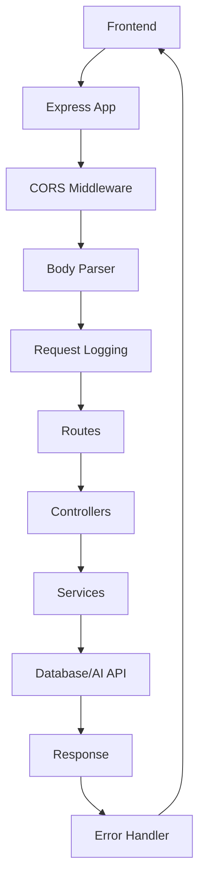

# 🚀 Backend 구조 가이드

> Node.js + Express + Supabase 기반의 포춘쿠키 AI 상담 API 서버

---

## 📋 목차
1. [프로젝트 개요](#-프로젝트-개요)
2. [폴더 구조](#-폴더-구조)
3. [핵심 설정](#️-핵심-설정)
4. [API 엔드포인트](#-api-엔드포인트)
5. [서비스별 상세 분석](#-서비스별-상세-분석)
6. [데이터베이스](#-데이터베이스)
7. [개발 & 운영](#-개발--운영)

---

## 🎯 프로젝트 개요

**Backend**는 포춘쿠키 AI 상담 서비스의 REST API 서버입니다.
- **기술 스택**: Node.js 18+ + Express 5 + Supabase
- **AI 연동**: OpenAI GPT-4o-mini API
- **아키텍처**: MVC 패턴 + 서비스 레이어
- **배포**: 포트 3001에서 실행

---

## 📁 폴더 구조

```
backend/
├─ 📄 설정 파일들
│  ├─ package.json          # 의존성 관리
│  ├─ .env (.env.example)   # 환경변수 설정
│  ├─ index.js              # 구버전 단일파일 (레거시)
│  └─ REFACTORING_SUMMARY.md # 리팩토링 보고서
│
└─ src/ (리팩토링된 구조)
   ├─ 🚀 앱 엔트리
   │  ├─ server.js          # 서버 시작점
   │  └─ app.js             # Express 앱 설정
   │
   ├─ ⚙️ 설정
   │  ├─ config/
   │  │  ├─ index.js        # 전체 설정 통합
   │  │  └─ database.js     # Supabase 연결 설정
   │
   ├─ 🛣️ 라우팅
   │  ├─ routes/
   │  │  ├─ index.js        # 메인 라우터
   │  │  ├─ authRoutes.js   # 인증 라우트
   │  │  └─ concernRoutes.js # 고민 상담 라우트
   │
   ├─ 🎮 컨트롤러
   │  ├─ controllers/
   │  │  ├─ authController.js    # 인증 요청 처리
   │  │  └─ concernController.js # 고민 상담 요청 처리
   │
   ├─ 🏢 서비스
   │  ├─ services/
   │  │  ├─ authService.js      # 인증 비즈니스 로직
   │  │  ├─ concernService.js   # 상담 비즈니스 로직
   │  │  └─ aiService.js        # AI 연동 서비스
   │
   ├─ 🛡️ 미들웨어
   │  ├─ middleware/
   │  │  ├─ index.js        # 미들웨어 통합
   │  │  ├─ cors.js         # CORS 설정
   │  │  └─ logging.js      # 요청/응답 로깅
   │
   └─ 🔧 유틸리티
      ├─ utils/
      │  ├─ errors.js       # 에러 처리
      │  ├─ logger.js       # 로깅 시스템
      │  └─ validation.js   # 입력값 검증
```

---

## ⚙️ 핵심 설정

### 📦 `package.json`
- **Node.js 18+** + Express 5 기반
- **주요 의존성**: Express, Supabase, Axios, CORS, dotenv
- **스크립트**: 
  - `dev`: `node --watch src/server.js` (개발모드)
  - `start`: `node src/server.js` (운영모드)

### 🌍 환경변수 (`.env`)
```bash
# 서버 설정
PORT=3001
NODE_ENV=development
CORS_ORIGIN=http://localhost:5173

# Supabase 설정
SUPABASE_URL=your-supabase-url
SUPABASE_ANON_KEY=your-anon-key  
SUPABASE_SERVICE_ROLE_KEY=your-service-role-key

# OpenAI API
OPENAI_API_KEY=your-openai-api-key
```

### 🚀 서버 시작 (`server.js`)
- **포트**: 3001 (기본값)
- **Graceful Shutdown**: SIGTERM/SIGINT 핸들링
- **로깅**: 구조화된 로그 출력
- **헬스체크**: 데이터베이스 연결 확인

---

## 🛣️ API 엔드포인트

### 기본 구조
```
Base URL: http://localhost:3001/api
```

### 📊 헬스체크
```http
GET /api/health
```
**응답**:
```json
{
  "status": "OK",
  "timestamp": "2025-09-24T10:30:00Z",
  "uptime": 3600
}
```

### 🔐 인증 관련 (`/api/auth`)
```http
POST /api/auth/verify    # 토큰 검증
GET  /api/auth/profile   # 사용자 프로필 조회
```

### 💭 고민 상담 관련 (`/api/concerns`)
```http
POST /api/concerns/ai-answer    # AI 답변 생성
POST /api/concerns/save         # 상담 기록 저장
GET  /api/concerns/:userId      # 사용자 상담 기록 조회
DELETE /api/concerns/:id        # 특정 상담 기록 삭제
```

---

## 🏢 서비스별 상세 분석

### 🤖 **AI Service** (`aiService.js`)

**📍 역할**: OpenAI GPT-4o-mini와의 연동  
**📊 규모**: 42줄  
**🎯 핵심**: 포춘쿠키 스타일 AI 답변 생성

#### 주요 기능
```javascript
class AIService {
  static async generateAnswer(persona, concern) {
    // GPT-4o-mini 호출
    // 50자 이내 한국어 답변 + 🍀 이모지
    // persona별 맞춤 조언
  }
}
```

#### AI 프롬프트 설정
- **시스템 역할**: 포춘쿠키 속 지혜로운 조언자
- **답변 길이**: 50자 이내 + 🍀 이모지
- **톤앤매너**: 따뜻하고 긍정적인 조언
- **상황별 대응**: 힘든 고민(위로) vs 일반 고민(용기/희망)

### 💭 **Concern Service** (`concernService.js`)

**📍 역할**: 상담 기록 CRUD 처리  
**📊 규모**: Supabase 연동  
**🗄️ 테이블**: `ai_answers`

#### 데이터 스키마
```sql
ai_answers {
  id: UUID (Primary Key)
  user_id: UUID (Foreign Key)
  persona: TEXT
  concern: TEXT  
  ai_response: TEXT
  created_at: TIMESTAMP
}
```

#### 주요 기능
- ✅ **저장**: 상담 기록 DB 저장
- ✅ **조회**: 사용자별 기록 조회
- ✅ **삭제**: 개별 기록 삭제
- ✅ **필터링**: 날짜/역할별 필터 지원

### 🔐 **Auth Service** (`authService.js`)

**📍 역할**: Supabase 인증 처리  
**📊 규모**: JWT 토큰 검증  
**🔑 방식**: Supabase Auth

#### 주요 기능
- ✅ **토큰 검증**: JWT 토큰 유효성 확인
- ✅ **사용자 정보**: Supabase에서 사용자 데이터 조회
- ✅ **권한 확인**: API 접근 권한 검증

---

## 🎮 컨트롤러 계층

### 📝 **Concern Controller**
```javascript
class ConcernController {
  // AI 답변 생성
  static async generateAIAnswer(req, res, next)
  
  // 상담 기록 저장  
  static async saveConcern(req, res, next)
  
  // 사용자 기록 조회
  static async getUserConcerns(req, res, next)
  
  // 기록 삭제
  static async deleteConcern(req, res, next)
}
```

#### 입력 검증
- **필수 필드**: persona, concern, userId 등
- **데이터 타입**: UUID, 문자열 길이 검증
- **에러 핸들링**: 400/401/500 상태코드 처리

### 🔐 **Auth Controller**
```javascript
class AuthController {
  // 토큰 검증
  static async verifyToken(req, res, next)
  
  // 프로필 조회
  static async getProfile(req, res, next)
}
```

---

## 🛡️ 미들웨어 시스템

### 🌍 **CORS 설정** (`cors.js`)
```javascript
// 프론트엔드 도메인 허용
origin: process.env.CORS_ORIGIN || 'http://localhost:5173'
methods: ['GET', 'POST', 'DELETE']
credentials: true
```

### 📝 **로깅 미들웨어** (`logging.js`)
```javascript
// 요청 로깅
requestLogging: method, url, ip, timestamp

// 응답 로깅  
responseLogging: status, response_time, error_info
```

### ❌ **에러 처리** (`errors.js`)
```javascript
// 커스텀 에러 클래스들
ValidationError      // 400 Bad Request
AuthenticationError  // 401 Unauthorized  
ExternalServiceError // 502 Bad Gateway
DatabaseError        // 500 Internal Server Error
```

---

## 🗄️ 데이터베이스

### 📊 **Supabase 연결**
- **클라이언트**: `@supabase/supabase-js`
- **인증**: Service Role Key 사용
- **연결 확인**: 서버 시작 시 자동 체크

### 🏗️ **테이블 구조**
```sql
-- 사용자 테이블 (Supabase Auth 기본)
auth.users {
  id: UUID
  email: TEXT
  created_at: TIMESTAMP
}

-- AI 상담 기록 테이블
public.ai_answers {
  id: UUID DEFAULT gen_random_uuid() PRIMARY KEY,
  user_id: UUID REFERENCES auth.users(id),
  persona: TEXT NOT NULL,
  concern: TEXT NOT NULL,
  ai_response: TEXT NOT NULL,
  created_at: TIMESTAMP DEFAULT NOW()
}
```

### 🔒 **Row Level Security (RLS)**
- **정책**: 사용자는 본인 데이터만 접근 가능
- **인증**: JWT 토큰 기반 사용자 식별

---

## 🔄 데이터 흐름

### API 요청 플로우

```mermaid
flowchart TD
    A[Frontend] --> B[Express App]
    B --> C[CORS Middleware]
    C --> D[Body Parser]
    D --> E[Request Logging]
    E --> F[Routes]
    F --> G[Controllers]
    G --> H[Services]
    H --> I[Database/AI API]
    I --> J[Response]
    J --> K[Error Handler]
    K --> A
```

### AI 답변 생성 플로우
```
1. POST /api/concerns/ai-answer
2. Controller → 입력값 검증
3. AIService → OpenAI API 호출
4. 답변 생성 (50자 + 🍀)
5. JSON 응답 반환
```

### 상담 기록 저장 플로우  
```
1. POST /api/concerns/save
2. Controller → 인증 확인
3. ConcernService → Supabase INSERT
4. 성공/실패 응답
```

