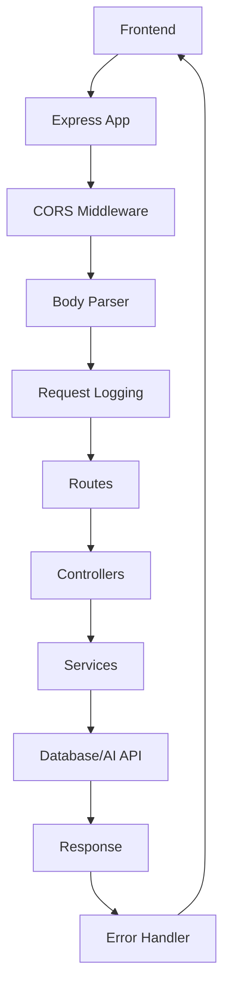

# 🚀 Backend 구조 가이드

> Node.js + Express + Supabase 기반의 포춘쿠키 AI 상담 API 서버

---

## 📋 목차
1. [🔄 테스트/운영 설정 전환 가이드](#-테스트운영-설정-전환-가이드) ⚡
2. [프로젝트 개요](#-프로젝트-개요)
3. [폴더 구조](#-폴더-구조)
4. [핵심 설정](#️-핵심-설정)
5. [API 엔드포인트](#-api-엔드포인트)
6. [서비스별 상세 분석](#-서비스별-상세-분석)
7. [데이터베이스](#-데이터베이스)
8. [일일 사용 제한 시스템](#-일일-사용-제한-시스템)
9. [개발 & 운영](#-개발--운영)

---

## 🔄 테스트/운영 설정 전환 가이드

### 📍 **현재 상태** (2025년 10월 28일 기준)
- **Daily Usage 체크**: 운영용 (24시간 제한) ✅
- **로그 자동 삭제**: 운영용 (24시간 이전 로그 삭제) ✅
- **스케줄러**: 운영용 (1시간마다 실행) ✅

### 🚀 **테스트용으로 전환하기**

#### 1️⃣ **일일 사용 제한을 1분으로 변경** 
📂 `backend/src/services/dailyUsageLogService.js` (49-57줄)
📂 `backend/src/services/accessControlService.js` (192-219줄)

```javascript
// 운영용 코드를 주석 처리하고
// === 운영용: 24시간 제한 (운영시 활성화) ===
// const today = new Date();
// today.setHours(0, 0, 0, 0);
// ...

// 테스트용 코드 주석 해제
// === 테스트용: 1분 제한 (테스트시 주석 해제 필요) ===
const now = new Date();
const oneMinuteAgo = new Date(now.getTime() - 1 * 60 * 1000); // 1분 전
// ...
```

#### 2️⃣ **로그 삭제를 1분으로 변경**
📂 `backend/src/utils/scheduler.js` (37-66줄)

```javascript
// 운영용 함수를 주석 처리하고
// === 운영용: 24시간 이전 로그 삭제 (기본값) ===
// export const cleanupOldUsageLogs = async () => {
// ...

// 테스트용 함수 주석 해제  
// === 테스트용: 1분 이전 로그 삭제 (테스트시 주석 해제 필요) ===
export const cleanupOldUsageLogs = async () => {
  const minutesToKeep = 1; // 1분 이전 로그 삭제
  // ...
```

### 🏭 **운영용으로 전환하기**

#### 1️⃣ **일일 사용 제한을 24시간으로 변경**
📂 `backend/src/services/dailyUsageLogService.js` + `accessControlService.js`
- 테스트용 1분 코드 → 주석 처리
- 운영용 24시간 코드 → 주석 해제

#### 2️⃣ **로그 삭제를 24시간으로 변경**  
📂 `backend/src/utils/scheduler.js`
- 테스트용 1분 삭제 함수 → 주석 처리
- 운영용 24시간 삭제 함수 → 주석 해제

#### 3️⃣ **스케줄러 빈도를 30초로 변경**
📂 `backend/src/utils/scheduler.js` (130-153줄)
- 운영용 1시간 스케줄러 → 주석 처리
- 테스트용 30초 스케줄러 → 주석 해제

### ⚡ **빠른 체크리스트**
- [ ] `dailyUsageLogService.js` - 테스트(1분)/운영(24시간) 설정 확인
- [ ] `accessControlService.js` - 테스트(1분)/운영(24시간) 설정 확인  
- [ ] `scheduler.js` - 로그 삭제 테스트(1분)/운영(24시간) 설정 확인
- [ ] `scheduler.js` - 스케줄러 빈도 테스트(30초)/운영(1시간) 설정 확인
- [ ] 서버 재시작 후 로그 확인

---

## 🎯 프로젝트 개요

**Backend**는 포춘쿠키 AI 상담 서비스의 REST API 서버입니다.
- **기술 스택**: Node.js 18+ + Express 5 + Supabase
- **AI 연동**: OpenAI GPT-4o-mini API
- **아키텍처**: MVC 패턴 + 서비스 레이어
- **배포**: 포트 3001에서 실행

---

## 📁 폴더 구조

```
backend/
├─ 📄 설정 파일들
│  ├─ package.json          # 의존성 관리
│  ├─ .env (.env.example)   # 환경변수 설정
│  ├─ index.js              # 구버전 단일파일 (레거시)
│  └─ REFACTORING_SUMMARY.md # 리팩토링 보고서
│
└─ src/ (리팩토링된 구조)
   ├─ 🚀 앱 엔트리
   │  ├─ server.js          # 서버 시작점
   │  └─ app.js             # Express 앱 설정
   │
   ├─ ⚙️ 설정
   │  ├─ config/
   │  │  ├─ index.js        # 전체 설정 통합
   │  │  └─ database.js     # Supabase 연결 설정
   │
   ├─ 🛣️ 라우팅
   │  ├─ routes/
   │  │  ├─ index.js        # 메인 라우터
   │  │  ├─ authRoutes.js   # 인증 라우트
   │  │  └─ concernRoutes.js # 고민 상담 라우트
   │
   ├─ 🎮 컨트롤러
   │  ├─ controllers/
   │  │  ├─ authController.js    # 인증 요청 처리
   │  │  └─ concernController.js # 고민 상담 요청 처리
   │
   ├─ 🏢 서비스
   │  ├─ services/
   │  │  ├─ authService.js      # 인증 비즈니스 로직
   │  │  ├─ concernService.js   # 상담 비즈니스 로직
   │  │  └─ aiService.js        # AI 연동 서비스
   │
   ├─ 🛡️ 미들웨어
   │  ├─ middleware/
   │  │  ├─ index.js        # 미들웨어 통합
   │  │  ├─ cors.js         # CORS 설정
   │  │  └─ logging.js      # 요청/응답 로깅
   │
   └─ 🔧 유틸리티
      ├─ utils/
      │  ├─ errors.js       # 에러 처리
      │  ├─ logger.js       # 로깅 시스템
      │  └─ validation.js   # 입력값 검증
```

---

## ⚙️ 핵심 설정

### 📦 `package.json`
- **Node.js 18+** + Express 5 기반
- **주요 의존성**: Express, Supabase, Axios, CORS, dotenv
- **스크립트**: 
  - `dev`: `node --watch src/server.js` (개발모드)
  - `start`: `node src/server.js` (운영모드)

### 🌍 환경변수 (`.env`)
```bash
# 서버 설정
PORT=3001
NODE_ENV=development
CORS_ORIGIN=http://localhost:5173

# Supabase 설정
SUPABASE_URL=your-supabase-url
SUPABASE_ANON_KEY=your-anon-key  
SUPABASE_SERVICE_ROLE_KEY=your-service-role-key

# OpenAI API
OPENAI_API_KEY=your-openai-api-key
```

### 🚀 서버 시작 (`server.js`)
- **포트**: 3001 (기본값)
- **Graceful Shutdown**: SIGTERM/SIGINT 핸들링
- **로깅**: 구조화된 로그 출력
- **헬스체크**: 데이터베이스 연결 확인

---

## 🛣️ API 엔드포인트

### 기본 구조
```
Base URL: http://localhost:3001/api
```

### 📊 헬스체크
```http
GET /api/health
```
**응답**:
```json
{
  "status": "OK",
  "timestamp": "2025-09-24T10:30:00Z",
  "uptime": 3600
}
```

### 🔐 인증 관련 (`/api/auth`)
```http
POST /api/auth/verify    # 토큰 검증
GET  /api/auth/profile   # 사용자 프로필 조회
```

### 💭 고민 상담 관련 (`/api/concerns`)
```http
POST /api/concerns/ai-answer    # AI 답변 생성
POST /api/concerns/save         # 상담 기록 저장
GET  /api/concerns/:userId      # 사용자 상담 기록 조회
DELETE /api/concerns/:id        # 특정 상담 기록 삭제
```

---

## 🏢 서비스별 상세 분석

### 🤖 **AI Service** (`aiService.js`)

**📍 역할**: OpenAI GPT-4o-mini와의 연동  
**📊 규모**: 42줄  
**🎯 핵심**: 포춘쿠키 스타일 AI 답변 생성

#### 주요 기능
```javascript
class AIService {
  static async generateAnswer(persona, concern) {
    // GPT-4o-mini 호출
    // 50자 이내 한국어 답변 + 🍀 이모지
    // persona별 맞춤 조언
  }
}
```

#### AI 프롬프트 설정
- **시스템 역할**: 포춘쿠키 속 지혜로운 조언자
- **답변 길이**: 50자 이내 + 🍀 이모지
- **톤앤매너**: 따뜻하고 긍정적인 조언
- **상황별 대응**: 힘든 고민(위로) vs 일반 고민(용기/희망)

### 💭 **Concern Service** (`concernService.js`)

**📍 역할**: 상담 기록 CRUD 처리  
**📊 규모**: Supabase 연동  
**🗄️ 테이블**: `ai_answers`

#### 데이터 스키마
```sql
ai_answers {
  id: UUID (Primary Key)
  user_id: UUID (Foreign Key)
  persona: TEXT
  concern: TEXT  
  ai_response: TEXT
  created_at: TIMESTAMP
}
```

#### 주요 기능
- ✅ **저장**: 상담 기록 DB 저장
- ✅ **조회**: 사용자별 기록 조회
- ✅ **삭제**: 개별 기록 삭제
- ✅ **필터링**: 날짜/역할별 필터 지원

### 🔐 **Auth Service** (`authService.js`)

**📍 역할**: Supabase 인증 처리  
**📊 규모**: JWT 토큰 검증  
**🔑 방식**: Supabase Auth

#### 주요 기능
- ✅ **토큰 검증**: JWT 토큰 유효성 확인
- ✅ **사용자 정보**: Supabase에서 사용자 데이터 조회
- ✅ **권한 확인**: API 접근 권한 검증

---

## 🎮 컨트롤러 계층

### 📝 **Concern Controller**
```javascript
class ConcernController {
  // AI 답변 생성
  static async generateAIAnswer(req, res, next)
  
  // 상담 기록 저장  
  static async saveConcern(req, res, next)
  
  // 사용자 기록 조회
  static async getUserConcerns(req, res, next)
  
  // 기록 삭제
  static async deleteConcern(req, res, next)
}
```

#### 입력 검증
- **필수 필드**: persona, concern, userId 등
- **데이터 타입**: UUID, 문자열 길이 검증
- **에러 핸들링**: 400/401/500 상태코드 처리

### 🔐 **Auth Controller**
```javascript
class AuthController {
  // 토큰 검증
  static async verifyToken(req, res, next)
  
  // 프로필 조회
  static async getProfile(req, res, next)
}
```

---

## 🛡️ 미들웨어 시스템

### 🌍 **CORS 설정** (`cors.js`)
```javascript
// 프론트엔드 도메인 허용
origin: process.env.CORS_ORIGIN || 'http://localhost:5173'
methods: ['GET', 'POST', 'DELETE']
credentials: true
```

### 📝 **로깅 미들웨어** (`logging.js`)
```javascript
// 요청 로깅
requestLogging: method, url, ip, timestamp

// 응답 로깅  
responseLogging: status, response_time, error_info
```

### ❌ **에러 처리** (`errors.js`)
```javascript
// 커스텀 에러 클래스들
ValidationError      // 400 Bad Request
AuthenticationError  // 401 Unauthorized  
ExternalServiceError // 502 Bad Gateway
DatabaseError        // 500 Internal Server Error
```

---

## 🗄️ 데이터베이스

### 📊 **Supabase 연결**
- **클라이언트**: `@supabase/supabase-js`
- **인증**: Service Role Key 사용
- **연결 확인**: 서버 시작 시 자동 체크

### 🏗️ **테이블 구조**
```sql
-- 사용자 테이블 (Supabase Auth 기본)
auth.users {
  id: UUID
  email: TEXT
  created_at: TIMESTAMP
}

-- AI 상담 기록 테이블
public.ai_answers {
  id: UUID DEFAULT gen_random_uuid() PRIMARY KEY,
  user_id: UUID REFERENCES auth.users(id),
  persona: TEXT NOT NULL,
  concern: TEXT NOT NULL,
  ai_response: TEXT NOT NULL,
  created_at: TIMESTAMP DEFAULT NOW()
}
```

### 🔒 **Row Level Security (RLS)**
- **정책**: 사용자는 본인 데이터만 접근 가능
- **인증**: JWT 토큰 기반 사용자 식별

---

## 🔄 데이터 흐름

### API 요청 플로우

```mermaid
flowchart TD
    A[Frontend] --> B[Express App]
    B --> C[CORS Middleware]
    C --> D[Body Parser]
    D --> E[Request Logging]
    E --> F[Routes]
    F --> G[Controllers]
    G --> H[Services]
    H --> I[Database/AI API]
    I --> J[Response]
    J --> K[Error Handler]
    K --> A
```

### AI 답변 생성 플로우
```
1. POST /api/concerns/ai-answer
2. Controller → 입력값 검증
3. AIService → OpenAI API 호출
4. 답변 생성 (50자 + 🍀)
5. JSON 응답 반환
```

### 상담 기록 저장 플로우  
```
1. POST /api/concerns/save
2. Controller → 인증 확인
3. ConcernService → Supabase INSERT
4. 성공/실패 응답
```

---

## 📊 일일 사용 제한 시스템

### 📋 **개요**
- 사용자가 하루에 한 번만 포춘쿠키를 받을 수 있도록 제한
- `daily_usage_log` 테이블을 통한 사용 기록 관리
- 자동 로그 정리 스케줄러 포함

### 🗄️ **테이블 구조**
```sql
-- 일일 사용 로그 테이블
public.daily_usage_log {
  id: UUID DEFAULT gen_random_uuid() PRIMARY KEY,
  user_id: UUID REFERENCES auth.users(id),
  used_at: TIMESTAMPZ DEFAULT NOW(),
  created_at: TIMESTAMPZ DEFAULT NOW()
}
```

### 🛣️ **API 엔드포인트**
```http
POST /api/daily-usage-logs              # 사용 기록 생성
GET  /api/daily-usage-logs/check-today  # 오늘 사용 여부 확인
GET  /api/daily-usage-logs/stats        # 사용 통계 조회
DELETE /api/daily-usage-logs/old        # 오래된 로그 삭제
```

### ⚙️ **테스트/운영 설정 전환**

#### 📍 **파일 위치 1: `backend/src/services/dailyUsageLogService.js`**
**현재 상태**: 운영용 (24시간 제한)
```javascript
// === 테스트용: 1분 제한 (운영시 주석 해제 필요) ===
const now = new Date();
const oneMinuteAgo = new Date(now.getTime() - 1 * 60 * 1000); // 1분 전

const { data, error, count } = await supabase
  .from('daily_usage_log')
  .select('*', { count: 'exact' })
  .eq('user_id', userId)
  .gte('used_at', oneMinuteAgo.toISOString());
```

**테스트용으로 전환**: 현재 활성화된 운영용 코드를 주석 처리하고 위 테스트용 주석을 해제
```javascript
// === 운영용: 24시간 제한 (운영시 활성화) ===
const today = new Date();
today.setHours(0, 0, 0, 0);
const todayStart = today.toISOString();

const todayEnd = new Date();
todayEnd.setHours(23, 59, 59, 999);
const todayEndStr = todayEnd.toISOString();

const { data, error, count } = await supabase
  .from('daily_usage_log')
  .select('*', { count: 'exact' })
  .eq('user_id', userId)
  .gte('used_at', todayStart)
  .lte('used_at', todayEndStr);
```

#### 📍 **파일 위치 2: `backend/src/services/accessControlService.js`**
**현재 상태**: 운영용 (24시간 제한)

#### 📍 **파일 위치 3: `backend/src/utils/scheduler.js`**
**현재 상태**: 운영용 (24시간 이전 로그 삭제) ✅

**테스트용으로 전환**: 
1. 운영용 `cleanupOldUsageLogs` 함수를 주석 처리
2. 테스트용 `cleanupOldUsageLogs` 주석을 해제
3. 테스트용 스케줄러 설정으로 변경

**테스트용 (현재 주석 처리됨)**:
```javascript
// === 테스트용: 1분 이전 로그 삭제 (테스트시 주석 해제 필요) ===
// export const cleanupOldUsageLogs = async () => {
//   try {
//     // 테스트용: 1분 이전 로그 삭제 (회원탈퇴한 사용자 포함)
//     const minutesToKeep = 1;
//     const cutoffTime = new Date();
//     cutoffTime.setMinutes(cutoffTime.getMinutes() - minutesToKeep);
//     // ... 나머지 코드
//   }
// };
```

**운영용 (현재 활성화됨)**:
```javascript
// === 운영용: 24시간 이전 로그 삭제 (기본값) ===
export const cleanupOldUsageLogs = async () => {
  try {
    // 운영용: 24시간(1일) 이전 로그 삭제 (회원탈퇴한 사용자 포함)
    const hoursToKeep = 24;
    const cutoffTime = new Date();
    cutoffTime.setHours(cutoffTime.getHours() - hoursToKeep);
    // ... 나머지 코드
  }
};
```

**테스트용 스케줄러 (현재 주석 처리됨)**:
```javascript
// === 스케줄러 시작 함수 (테스트용) ===
// export const startScheduler = () => {
//   setInterval(async () => {
//     await cleanupExpiredData(); // 30초마다 실행
//   }, 30000);
// };
```

**운영용 스케줄러 (현재 활성화됨)**:
```javascript
// === 운영용: 1시간마다 실행 (기본값) ===
export const startScheduler = () => {
  setInterval(async () => {
    await cleanupExpiredData(); // 1시간마다 실행
  }, 60 * 60 * 1000);
};
```

### 🔄 **동작 흐름**
1. **접근 권한 체크**: 페이지 진입 → 밴 상태 체크 → 학교 날짜 체크 → 일일 제한 체크
2. **사용 기록**: 역할 선택 → "다음 단계로" 클릭 → `daily_usage_log` 삽입
3. **자동 정리**: 스케줄러 → 오래된 로그 삭제 → 스토리지 절약
4. **회원탈퇴 보존**: 회원탈퇴해도 24시간 동안 로그 보존 (운영용) → 재가입 시 제한 유지

### 🛡️ **통합 접근 제어 시스템**

#### 📍 **새로운 API 엔드포인트**
```http
GET /api/access-control/check-access        # 기본 접근 권한만 체크
GET /api/access-control/check-daily-usage   # 일일 사용 제한만 체크  
GET /api/access-control/check-full-access   # 모든 권한 체크 (권장)
```

#### 🔐 **접근 제어 단계**
1. **🚫 밴 체크** - 최우선 (학교/날짜 상관없이 차단)
2. **🏫 학교 정보 체크** - 사용자에게 학교가 설정되어 있는지
3. **📅 학교 날짜 체크** - 관리자가 설정한 해당 학교의 이용 기간 내인지
4. **⏰ 일일 사용 제한** - 해당 학교 사용자의 24시간 제한 (운영용)

#### 📋 **체크 결과**
```javascript
{
  canAccess: true,    // 기본 접근 가능 (1-3단계 통과)
  canUse: false,      // 일일 사용 제한 (4단계 실패)
  reason: "가톨릭대학교 학생은 하루에 한 번만 이용할 수 있습니다.",
  user: { ... },      // 사용자 정보
  schoolPeriod: { ... } // 학교 기간 정보
}
```

### 🛡️ **회원탈퇴 시 보존 정책**

#### 📋 **정책 개요**
- **회원탈퇴해도 `daily_usage_log`는 24시간 동안 보존**
- 탈퇴 후 같은 계정으로 재가입 시에도 일일 제한 유지
- 24시간 후 자동 스케줄러에 의해 삭제

#### 📍 **구현 위치**: `backend/src/services/authService.js`
```javascript
// 2. daily_usage_log는 24시간 보존 정책에 따라 삭제하지 않음
// (스케줄러가 자동으로 24시간 후 삭제)
logger.info('daily_usage_log는 24시간 보존 정책에 따라 유지됨', { userId });
```

#### ⏰ **보존 기간**
- **테스트 환경**: 1분 보존 (테스트용) ⚡
- **운영 환경**: 24시간 보존
- 스케줄러가 자동으로 만료된 로그 삭제

---

## 🏫 학교별 날짜 제한 시스템

### 📋 **개요**  
- 관리자가 학교별로 서비스 이용 가능 날짜를 설정
- 해당 학교 사용자만 설정된 기간 내에 서비스 이용 가능
- 밴된 사용자는 날짜와 상관없이 무조건 차단

### 🗄️ **테이블 구조 활용**
- **기존 `school_periods` 테이블 사용**
- 관리자 대시보드 → 설정 탭에서 학교별 날짜 관리
- 학교 데이터는 `frontend_change/src/data/schools.json`에서 관리

### 🛣️ **관리 기능**
- **학교 검색**: 24개 대학교 데이터 검색 가능
- **날짜 설정**: 시작일과 종료일 설정
- **실시간 관리**: 추가, 수정, 삭제 즉시 반영

### ⚠️ **중요 규칙**
1. **밴 우선**: 밴된 사용자는 학교 날짜 상관없이 차단
2. **학교별 제한**: 각 학교별로 독립적인 일일 사용 제한
3. **날짜 체크**: 현재 날짜가 설정된 기간 내에 있어야 함
4. **설정 필수**: 학교 기간이 설정되지 않은 학교는 이용 불가

