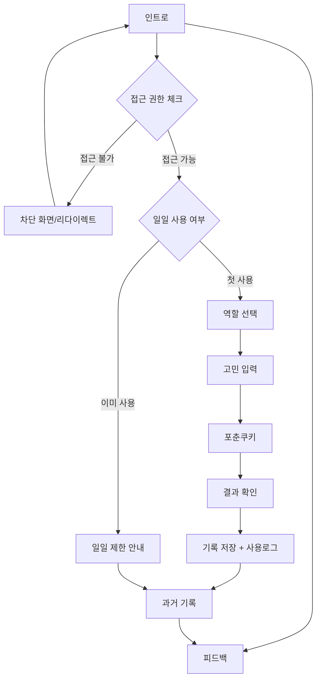
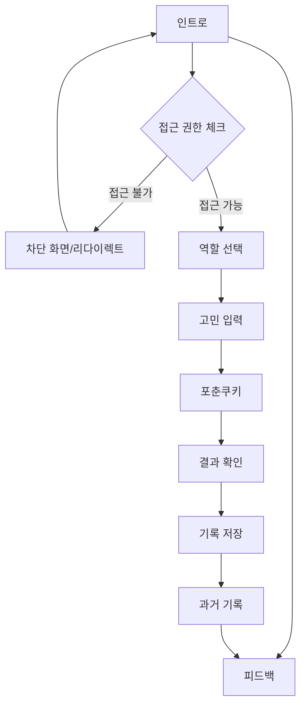

# 🥠 Frontend Change 구조 가이드

> React + Vite + TypeScript + Tailwind CSS 기반의 포춘쿠키 AI 상담 서비스

---

## 📋 목차
1. [프로젝트 개요](#-프로젝트-개요)
2. [폴더 구조](#-폴더-구조)
3. [핵심 설정 파일](#️-핵심-설정-파일)
4. [공통 컴포넌트](#-공통-컴포넌트)
5. [페이지별 상세 분석](#-페이지별-상세-분석)
6. [일일 사용 제한 시스템](#-일일-사용-제한-시스템)
7. [데이터 흐름](#-데이터-흐름)
8. [Supabase Realtime 실시간 업데이트](#-supabase-realtime-실시간-업데이트)
9. [코드 품질](#-코드-품질)

---

## 🎯 프로젝트 개요

**Frontend Change**는 포춘쿠키 스타일로 AI 조언을 제공하는 상담 서비스입니다.
- **기술 스택**: React 18 + Vite + TypeScript + Tailwind CSS
- **빌드 도구**: Vite (개발서버 + 빌드)
- **스타일링**: Tailwind CSS + 커스텀 애니메이션
- **배포**: SPA 형태로 `/out` 폴더에 빌드

---

## 📁 폴더 구조

```
frontend/
├─ 📄 설정 파일들
│  ├─ package.json          # 의존성 관리
│  ├─ vite.config.ts        # Vite 설정
│  ├─ tailwind.config.ts    # Tailwind 설정
│  ├─ tsconfig*.json        # TypeScript 설정
│  └─ postcss.config.cjs    # PostCSS 설정
│
└─ src/
   ├─ 🚀 앱 엔트리
   │  ├─ main.tsx           # React 앱 부트스트랩
   │  ├─ App.tsx            # 전역 레이아웃 셸
   │  ├─ index.css          # 글로벌 스타일
   │  └─ supabaseClient.ts  # Supabase 클라이언트
   │
   ├─ 🔧 공용 모듈
   │  ├─ constants/         # 상수 정의
   │  ├─ types/             # 타입 정의
   │  └─ utils/             # 유틸 함수
   │
   ├─ 🎨 컴포넌트
   │  ├─ base/              # 기본 UI 컴포넌트
   │  └─ feature/           # 기능별 컴포넌트
   │
   ├─ 🪝 훅(Hooks)
   │  ├─ useApi.ts          # API 호출
   │  ├─ useAuth.ts         # 인증 관리
   │  └─ useSessionUsage.ts # 세션 추적
   │
   ├─ 🛣️ 라우터
   │  ├─ config.tsx         # 라우트 설정
   │  └─ index.ts           # 라우터 프로바이더
   │
   └─ 📱 페이지들
      ├─ intro/             # 인트로 화면
      ├─ school-select/     # 학교 선택
      ├─ role-select/       # 역할 선택
      ├─ concern-input/     # 고민 입력
      ├─ fortune-cookie/    # 포춘쿠키 결과
      ├─ past-concerns/     # 이전 고민 기록
      ├─ feedback/          # 피드백 폼
      ├─ settings/          # 설정
      ├─ admin/             # 관리자 대시보드
      ├─ account-banned/    # 계정 밴 안내
      ├─ account-cooldown/  # 재가입 제한 안내
      ├─ account-deleted/   # 계정 삭제 완료
      ├─ oauth-callback/   # OAuth 콜백
      ├─ auth-callback/     # 인증 콜백
      └─ not-found/         # 404 에러
```

---

## ⚙️ 핵심 설정 파일

### 📦 `package.json`
- **React 18** + TypeScript + Vite 기반 SPA
- **주요 의존성**: React Router, Tailwind CSS, Supabase, EmailJS
- **스크립트**: `dev` (개발), `build` (빌드), `preview` (미리보기)

### ⚡ `vite.config.ts`
- **개발서버**: 포트 3000, Hot reload, TypeScript 지원
- **빌드 설정**: `/out` 폴더로 출력
- **SPA 모드**: 모든 라우트를 `index.html`로 처리
- **프록시**: `/api` 요청을 `http://localhost:4000`으로 프록시

### 🎨 `tailwind.config.ts`
- **스캔 경로**: `src/**/*.{js,ts,jsx,tsx}` 파일 감시
- **커스텀 설정**: 확장 가능한 테마 구조

### 📝 TypeScript 설정
- **앱용**: `tsconfig.json` (엄격한 타입 체크)
- **노드용**: `tsconfig.node.json` (Vite 설정용)
- **베이스**: `tsconfig.base.json` (공통 설정)

---

## 🎨 공통 컴포넌트

### 🧱 Base 컴포넌트 (`components/base/`)

#### `Button.tsx`
```tsx
// 재사용 가능한 버튼 프리미티브
interface ButtonProps extends React.ButtonHTMLAttributes<HTMLButtonElement> {
  variant?: 'primary' | 'secondary' | 'outline'
}
```

#### `Card.tsx`
```tsx
// 박스형 컨테이너 래퍼
interface CardProps extends React.HTMLAttributes<HTMLDivElement> {
  padding?: 'sm' | 'md' | 'lg'
}
```

### 🚀 Feature 컴포넌트 (`components/feature/`)

#### `Header.tsx`
- **역할**: 전역 상단 헤더바
- **기능**: 뒤로가기, 홈 이동 버튼
- **특별 처리**: `/past-concerns`에서는 뒤로가기를 홈으로 리다이렉트

---

## 🪝 핵심 훅(Hooks)

| 훅 이름 | 역할 | 주요 기능 |
|---------|------|-----------|
| `useApi` | API 호출 래퍼 | 에러/로딩 처리 일원화 |
| `useAuth` | 인증 관리 | Supabase 기반 로그인 상태 관리 |
| `useSessionUsage` | 세션 추적 | 사용량/상태 모니터링 |

---

## 📱 페이지별 상세 분석

### 🎬 1. **인트로 페이지** (`intro/`)

**📍 역할**: 앱 첫 화면, 로그인 처리  
**📊 규모**: 46줄, 4개 컴포넌트  
**🔐 인증**: 카카오 로그인/로그아웃

#### 컴포넌트 구성
```
intro/
├─ page.tsx                 # 메인 페이지 (46줄)
├─ HamburgerMenu.tsx        # 상단 햄버거 메뉴
├─ BackgroundDecorations.tsx # 배경 그라디언트/도형
├─ FloatingIcons.tsx        # 떠다니는 아이콘 애니메이션
└─ IntroMainContent.tsx     # 메인 카피/CTA 블록
```

#### 주요 기능
- ✅ 카카오 로그인/로그아웃
- ✅ 피드백/과거기록 페이지 이동
- ✅ 시각적 인트로 효과

---

### 🎭 2. **역할 선택 페이지** (`role-select/`)

**📍 역할**: AI 상담사 페르소나 선택  
**📊 규모**: 422줄, 5개 컴포넌트  
**🎯 선택지**: 기본 역할 1개 (학생) + 커스텀 역할 추가 가능

#### 컴포넌트 구성
```
role-select/
├─ page.tsx              # 메인 페이지 (422줄)
├─ PageTitle.tsx         # 페이지 제목
├─ RoleGrid.tsx          # 역할 카드 그리드
├─ CustomRoleInput.tsx   # 커스텀 역할 입력
├─ SelectedRoleDisplay.tsx # 선택된 역할 표시
└─ NextButton.tsx        # 다음 단계 버튼
```

#### 기본 제공 역할
| 역할 | 아이콘 | 설명 |
|------|-------|------|
| 학생 | 📚 (ri-book-line) | 학업과 진로 상담 |

**참고**: 기본 제공 역할은 '학생' 1개만 있으며, 나머지 역할은 사용자가 커스텀 역할로 추가할 수 있습니다. 커스텀 역할은 백엔드 `custom_roles` 테이블에 저장되며, 사용자별로 관리됩니다.

#### 상태 관리
- `selectedRole`: 선택된 기본 역할
- `customRole`: 사용자 입력 커스텀 역할
- `isCustom`: 커스텀 모드 여부

---

### 💭 3. **고민 입력 페이지** (`concern-input/`)

**📍 역할**: 상담 받을 고민 내용 입력  
**📊 규모**: 82줄, 5개 컴포넌트  
**📝 제한**: 최대 100자

#### 컴포넌트 구성
```
concern-input/
├─ page.tsx               # 메인 페이지 (82줄)
├─ PageTitle.tsx          # 페이지 제목
├─ SelectedRoleDisplay.tsx # 선택된 역할 표시
├─ ConcernInputArea.tsx   # 고민 입력 텍스트 영역
├─ SuggestedConcerns.tsx  # 추천 고민 예시
└─ SubmitButton.tsx       # 제출 버튼
```

#### 상태 관리
- `concern`: 고민 내용 (최대 100자)
- `isSubmitting`: 제출 중 상태
- `charCount`: 실시간 글자수 카운트

#### 제출 플로우
1. 고민 내용 검증 (빈값/길이 체크)
2. 로딩 상태 표시
3. `fortune-cookie` 페이지로 데이터 전달

---

### 🥠 4. **포춘쿠키 페이지** (`fortune-cookie/`)

**📍 역할**: 쿠키 애니메이션 + AI 답변 표시  
**📊 규모**: 233줄, 6개 컴포넌트  
**🎭 핵심**: 포춘쿠키 열기 연출 + 결과 공유

#### 컴포넌트 구성
```
fortune-cookie/
├─ page.tsx                # 메인 페이지 (233줄)
├─ RoleInfoDisplay.tsx     # 역할 정보 표시
├─ CookieAnimationArea.tsx # 애니메이션 제어 영역
├─ FortuneCookie.tsx       # 쿠키 그래픽/애니메이션
└─ FortuneResultDisplay.tsx # AI 답변 텍스트 표시
```

> **참고**: ShareButtons.tsx와 ActionButtons.tsx는 코드에 존재하지만 실제로는 사용되지 않습니다.

#### 애니메이션 플로우
1. **쿠키 대기** → 클릭 유도
2. **쿠키 열기** → 크랙 애니메이션
3. **답변 공개** → 페이드인 효과

#### API 연동
- **백엔드**: `useApi` 훅으로 AI 답변 요청
- **저장**: Supabase에 상담 기록 저장
- **히스토리**: localStorage에 최대 50개 보관

#### 외부 SDK
- **카카오**: 공유 기능 (SDK 로드)
- **클립보드**: 링크 복사 기능

#### 상태 관리
- `isOpening`: 쿠키 열기 중
- `isOpened`: 쿠키 열림 완료
- `showFortune`: 답변 표시 여부
- `fortuneMessage`: AI 답변 텍스트
- `isSharing`: 공유 진행 중

---

### 📄 5. **이전 고민 페이지** (`past-concerns/`)

**📍 역할**: 과거 상담 기록 조회/관리  
**📊 규모**: 503줄, 12개 컴포넌트  
**🎯 특징**: 가장 복잡한 페이지, 전문가급 분리

#### 컴포넌트 구성
```
past-concerns/
├─ page.tsx                 # 메인 페이지 (503줄)
├─ PageHeader.tsx           # 페이지 헤더
├─ LoginPrompt.tsx          # 로그인 안내
├─ LoadingState.tsx         # 로딩 상태 UI
├─ EmptyState.tsx           # 빈 상태 UI
├─ StatisticsCards.tsx      # 통계 카드 4개
├─ FilterAndSearchBar.tsx   # 검색/필터/정렬 바
├─ ActiveFilters.tsx        # 활성 필터 표시
├─ PastConcernCard.tsx      # 개별 기록 카드
├─ PastConcernGrid.tsx      # 그리드/리스트 컨테이너
├─ DetailModal.tsx          # 상세보기 모달
├─ DeleteConfirmModal.tsx   # 삭제 확인 모달
└─ Pagination.tsx           # 페이지네이션
```

#### 통계 카드 (StatisticsCards.tsx)
| 카드 | 내용 | 계산 방식 |
|------|------|-----------|
| 📊 총 운세 | 전체 상담 횟수 | 총 기록 수 |
| 🎭 상담 역할 | 사용한 역할 종류 | 고유 역할 수 |
| 📅 최근 7일 | 일주일간 활동 | 날짜 필터링 |
| 📈 주 평균 | 주당 평균 상담 | 통계 계산 |

#### 고급 기능
- ✅ **검색**: 고민/답변 내용 텍스트 검색
- ✅ **필터**: 역할별, 날짜 범위 필터링
- ✅ **정렬**: 최신순, 오래된순
- ✅ **뷰 모드**: 그리드/리스트 전환
- ✅ **페이지네이션**: 페이지별 데이터 로드
- ✅ **모달**: 상세보기, 삭제 확인

#### 데이터 소스
1. **Primary**: Supabase (로그인 사용자의 영구 저장)
2. **Backup**: localStorage (fortune-cookie 페이지에서 백업용으로만 사용)

> **localStorage 사용 이유**: 
> - fortune-cookie 페이지에서 Supabase 저장 **후에 추가로** localStorage에도 백업 저장
> - 최대 50개 기록 보관으로 용량 관리
> - past-concerns 페이지는 **오직 Supabase 데이터만** 사용 (로그인 필수)
> - 로그인하지 않으면 과거 기록을 볼 수 없음

#### 복잡한 상태 관리 (15개+)
```typescript
// 데이터 상태
const [history, setHistory] = useState([])
const [filteredHistory, setFilteredHistory] = useState([])
const [statistics, setStatistics] = useState({})

// UI 상태  
const [isLoading, setIsLoading] = useState(true)
const [viewMode, setViewMode] = useState('grid')
const [searchTerm, setSearchTerm] = useState('')

// 필터 상태
const [selectedRole, setSelectedRole] = useState('')  
const [dateRange, setDateRange] = useState({})

// 모달 상태
const [detailModal, setDetailModal] = useState({})
const [deleteModal, setDeleteModal] = useState({})

// 페이지네이션
const [currentPage, setCurrentPage] = useState(1)
const [itemsPerPage] = useState(12)
```

---

### 📝 6. **피드백 페이지** (`feedback/`)

**📍 역할**: 사용자 피드백 수집  
**📊 규모**: 147줄, 9개 컴포넌트  
**📧 전송**: EmailJS 활용

#### 컴포넌트 구성
```
feedback/
├─ page.tsx            # 메인 페이지 (147줄)
├─ PageTitle.tsx       # 페이지 제목
├─ LoadingState.tsx    # 로딩 상태
├─ LoginRequired.tsx    # 로그인 필수 안내
├─ SubmissionSuccess.tsx # 전송 완료 안내
├─ FeedbackType.tsx    # 피드백 유형 선택
├─ Rating.tsx           # 별점 평가 (1~5점)
├─ MessageInput.tsx    # 피드백 본문 (500자 제한)
├─ EmailInput.tsx      # 연락처 (선택사항)
└─ SubmitButtons.tsx   # 제출/취소 버튼
```

#### 피드백 유형 (FeedbackType.tsx)
```
┌─────────────┬─────────────┐
│ 💡 개선제안  │ 🐛 버그신고  │
├─────────────┼─────────────┤  
│ ❤️ 칭찬     │ 💬 기타     │
└─────────────┴─────────────┘
```

#### 평점 시스템 (Rating.tsx)
- ⭐ 1~5점 별점 클릭 선택
- hover/active 시 amber 색상 피드백
- 필수 입력 항목

#### 폼 검증
- **필수**: 유형, 평점, 메시지 (500자 제한)
- **선택**: 이메일 (답변 필요시)
- **실시간**: 글자수 카운터

#### 전송 플로우
1. 로그인 상태 확인 (Supabase)
2. 폼 검증 (필수값 체크)
3. EmailJS로 이메일 전송
4. 성공 페이지 표시

---

### ❌ 7. **404 에러 페이지** (`not-found/`)

**📍 역할**: 잘못된 URL 처리  
**📊 규모**: 18줄, 2개 컴포넌트  
**🎯 기능**: 단순 에러 안내 + 내비게이션

#### 컴포넌트 구성
```
not-found/
├─ page.tsx             # 메인 페이지 (18줄)
├─ ErrorMessage.tsx     # 에러 안내 메시지
└─ NavigationButtons.tsx # 홈/뒤로가기 버튼
```

---

## 📊 일일 사용 제한 시스템

### 📋 **개요**
- 사용자가 하루에 한 번만 포춘쿠키를 받을 수 있도록 제한
- 역할 선택 페이지에서 사용 여부 체크 및 제한 처리

### 🎯 **주요 파일**
- **페이지**: `frontend/src/pages/role-select/page.tsx`
- **API 호출**: `/api/access-control/check-full-access` 엔드포인트 사용
- **접근 제어**: `frontend/src/pages/intro/components/IntroMainContent.tsx`에서도 동일 API 사용

### 🔄 **동작 흐름**

#### 1️⃣ **페이지 진입 시 체크**
```typescript
// 접근 권한 및 일일 사용 제한 확인
const response = await apiFetch(`/api/access-control/check-full-access`);
const data = await response.json();

if (!data.canAccess) {
  // 접근 불가 화면 표시 (밴 상태, 학교 정보 없음, 기간 외 등)
}

if (!data.canUse) {
  // 일일 사용 제한 화면 표시
}
```

#### 2️⃣ **차단 화면 표시**
```jsx
// 접근 불가 또는 일일 사용 제한에 걸린 경우
if (!data.canAccess) {
  // AccessModal 컴포넌트로 접근 불가 안내
  // - 밴 상태: account-banned 페이지로 리다이렉트
  // - 학교 정보 없음: school-select 페이지로 리다이렉트
  // - 기간 외: 경고 메시지 표시
}

if (!data.canUse) {
  // AccessModal 컴포넌트로 일일 사용 제한 안내
  // - "오늘의 포춘쿠키를 이미 받으셨어요!" 메시지
  // - 다음 이용 가능 시간 카운트다운 표시
}
```

#### 3️⃣ **사용 기록 생성**
```typescript
// 포춘쿠키 페이지에서 결과 표시 시 자동 생성
const response = await apiFetch('/api/daily-usage-logs', {
  method: 'POST',
  headers: { 'Content-Type': 'application/json' },
  body: JSON.stringify({ userId: user.id }),
});
```

### ⚙️ **테스트 설정**
**현재 상태**: 테스트용 (1분 제한) ⚡
- 1분 후 다시 사용 가능  
- 백엔드에서 제한 시간 설정 변경 가능

**운영 전환**: `backend/src/services/accessControlService.js`에서 주석 변경

### 🛡️ **회원탈퇴 시 재가입 제한 정책**

#### 📋 **정책 개요**
- **회원탈퇴 시 `deletion_restrictions` 테이블에 해시값만 저장**
- 이메일, User-Agent, IP 주소를 SHA-256 해시로 변환하여 저장 (개인정보 없음)
- 탈퇴 후 같은 계정으로 재가입 시에도 24시간 동안 제한 유지
- 24시간 후 자동 스케줄러에 의해 해시 정보 삭제

#### 🔐 **해시화 방식**
- **이메일**: SHA-256 해시 (64자)
- **User-Agent**: SHA-256 해시 (브라우저 핑거프린트)
- **IP 주소**: SHA-256 해시
- **개인정보 보호**: 원본 데이터는 저장하지 않고 해시값만 저장

#### 🔄 **동작 시나리오**
1. **사용자 A**: 포춘쿠키 사용 → 일일 제한 적용
2. **회원탈퇴**: 계정 삭제, `daily_usage_log`는 즉시 삭제
3. **해시 저장**: `deletion_restrictions` 테이블에 해시값 저장 (24시간 유효)
4. **재가입**: 같은 계정으로 재가입 시도
5. **제한 유지**: 24시간 경과 전까지 사용 불가 (해시값으로 확인)

#### ⚠️ **중요 사항**
- 회원탈퇴로 일일 제한을 우회할 수 없음
- `daily_usage_log`는 회원탈퇴 시 즉시 삭제됨
- 재가입 제한은 `deletion_restrictions` 테이블의 해시값으로 관리됨
- 해시 정보는 자동 스케줄러에 의해 24시간 후 삭제 (운영용)

---

## 🏫 학교별 날짜 제한 시스템

### 📋 **관리자 기능**
- **관리자 대시보드** → **설정 탭**에서 학교별 이용 기간 설정
- 24개 대학교 데이터 검색 및 선택 가능
- 시작일/종료일 설정으로 정확한 이용 기간 관리

### 🎯 **학교 데이터**
- **위치**: `frontend/src/data/schools.json`
- **포함 학교**: 서울/경기/인천 주요 대학교 24개
- **검색 기능**: 학교명, 지역별 검색 지원

### 🔄 **접근 제어 흐름**
1. **사용자 로그인** → 2. **인트로 페이지에서 접근 권한 체크** (`/api/access-control/check-full-access`)
2. **결과에 따른 화면 분기**:
   - ✅ **접근 가능 + 사용 가능**: 정상 화면 (역할 선택 페이지 등)
   - ⚠️ **접근 가능 + 사용 불가**: AccessModal로 "오늘의 포춘쿠키를 이미 받으셨어요!" 표시
   - ❌ **접근 불가**: 
     - 밴 상태 → `/account-banned` 페이지로 리다이렉트
     - 학교 정보 없음 → `/school-select` 페이지로 리다이렉트
     - 기간 외 → AccessModal로 경고 메시지 표시
     - 재가입 제한 → `/account-cooldown` 페이지로 리다이렉트

### 📊 **체크 우선순위**
1. **🚫 밴 상태** (최우선)
2. **🏫 학교 정보** 존재 여부
3. **📅 학교 이용 기간** 범위 내
4. **⏰ 일일 사용 제한** (학교별)

---

## 🎛️ 관리자 설정 탭 (SettingsTab)

### 📋 **개요**
- **위치**: `frontend/src/pages/admin/components/SettingsTab.tsx`
- **역할**: 학교별 서비스 이용 기간 관리 (Access Period)
- **규모**: 620줄, 커스텀 캘린더 컴포넌트 포함

### 🎨 **주요 기능**

#### 1️⃣ **Apple Style Calendar 컴포넌트**
- **커스텀 캘린더**: Apple 스타일의 모던한 날짜 선택 UI
- **기능**:
  - 월별 네비게이션 (이전/다음 달)
  - 오늘 날짜 하이라이트
  - 선택된 날짜 강조 표시
  - 주말 색상 구분 (일요일: 빨강, 토요일: 파랑)
  - "오늘" 버튼으로 빠른 선택
  - 외부 클릭 시 자동 닫기
- **자동 연속 선택**: 시작일 선택 후 종료일 달력 자동으로 열림

#### 2️⃣ **학교 검색 및 선택**
- **검색 기능**:
  - 실시간 학교명 검색
  - 학교 카테고리 검색 지원
  - 검색어로 시작하는 학교 우선 정렬
  - 최대 60개 결과 표시 (스크롤 가능)
- **선택 UI**:
  - 선택된 학교 하이라이트 (파란색 배경)
  - 체크마크(✓) 표시
  - 호버 효과 및 액티브 상태 피드백

#### 3️⃣ **CRUD 기능**
- **추가 (Create)**: 새로운 학교 기간 추가
- **수정 (Update)**: 기존 기간 수정 (수정 버튼 클릭 시 폼으로 스크롤)
- **삭제 (Delete)**: 확인 후 삭제
- **조회 (Read)**: 페이지네이션으로 목록 조회

#### 4️⃣ **로딩 상태 분리**
- **리스트 로딩** (`listLoading`): 데이터 조회 시 표시
- **폼 제출 로딩** (`formLoading`): 폼 제출 시 버튼만 "처리중..." 표시
- **UX 최적화**: 리스트 로딩 중에도 폼은 사용 가능

#### 5️⃣ **페이지네이션**
- **페이지당 항목**: 5개
- **네비게이션**: 이전/다음 버튼 + 페이지 번호 버튼
- **현재 페이지**: 파란색 배경으로 강조

### 🔄 **데이터 흐름**

```
사용자 입력
    ↓
폼 검증 (학교명, 시작일, 종료일)
    ↓
날짜 유효성 검사 (시작일 < 종료일)
    ↓
API 호출 (POST/PUT /api/school-periods)
    ↓
성공 시 목록 새로고침
```

### 📊 **상태 관리**

```typescript
// 데이터 상태
const [schoolPeriods, setSchoolPeriods] = useState<SchoolPeriod[]>([]);
const [formData, setFormData] = useState<SchoolPeriod>({
  school_name: '',
  start_date: '',
  end_date: ''
});

// UI 상태
const [listLoading, setListLoading] = useState(false);
const [formLoading, setFormLoading] = useState(false);
const [searchTerm, setSearchTerm] = useState('');
const [editingId, setEditingId] = useState<string | null>(null);
const [currentPage, setCurrentPage] = useState(1);
const [openEndCalendar, setOpenEndCalendar] = useState(false);

// 메모이제이션
const filteredSchools = useMemo(() => {
  // 검색어로 필터링 및 정렬
}, [searchTerm]);
```

### 🎯 **주요 특징**

1. **UX 최적화**:
   - 시작일 선택 후 종료일 달력 자동 열기
   - 수정 시 폼으로 자동 스크롤
   - 선택된 학교 검색어에 자동 입력

2. **검색 최적화**:
   - 검색어로 시작하는 학교 우선 정렬
   - 학교명과 카테고리 모두 검색 가능
   - 대소문자 구분 없음

3. **에러 처리**:
   - 필수 필드 검증
   - 날짜 범위 검증
   - API 에러 메시지 표시

4. **다크 모드 지원**:
   - 모든 UI 요소에 다크 모드 스타일 적용
   - 캘린더, 검색창, 버튼 등 일관된 테마

### 📝 **API 엔드포인트**

| 메서드 | 엔드포인트 | 설명 |
|--------|-----------|------|
| `GET` | `/api/school-periods` | 모든 학교 기간 조회 |
| `POST` | `/api/school-periods` | 새로운 학교 기간 추가 |
| `PUT` | `/api/school-periods/:id` | 학교 기간 수정 |
| `DELETE` | `/api/school-periods/:id` | 학교 기간 삭제 |

### 💡 **사용 안내 (Info Card)**

설정 탭 하단에 표시되는 안내 메시지:
- 밴된 사용자는 학교 날짜 설정과 관계없이 서비스 이용 불가
- 사용자는 자신의 학교가 설정된 날짜에만 서비스 이용 가능
- 일일 사용 제한은 학교별로 적용
- 날짜 범위를 벗어난 경우 자동으로 서비스 이용 차단

---

## 🔄 데이터 흐름

### 일일 제한이 적용된 사용자 여정


### 기본 사용자 여정 (제한 없음)


### API 통신 구조
```
프론트엔드 → 백엔드 API → AI 서비스
     ↓           ↓
 Supabase ← 기록 저장
     ↓
localStorage (백업)
```

### 주요 데이터 저장소
| 저장소 | 용도 | 데이터 |
|--------|------|--------|
| **Supabase** | 메인 DB | 사용자별 상담 기록 (인증 필요) |
| **localStorage** | 로컬 백업 | 백업 기록 (최대 50개) |
| **React State** | 임시 상태 | 페이지간 데이터 전달 (location.state) |

---

## ⚡ Supabase Realtime 실시간 업데이트

### 📋 **개요**
- **위치**: `frontend/src/pages/settings/page.tsx`
- **기능**: 사용자 학교 정보 실시간 동기화
- **목적**: 관리자가 사용자 학교 정보를 변경하면 즉시 반영

### 🎯 **구현 위치**
- **페이지**: 설정 페이지 (My Info)
- **구독 대상**: `users` 테이블의 `UPDATE` 이벤트
- **필터링**: 현재 로그인한 사용자 ID만 구독

### 🔄 **동작 흐름**

```
관리자가 사용자 학교 정보 변경
    ↓
Supabase DB 업데이트
    ↓
Realtime 이벤트 발생 (UPDATE)
    ↓
프론트엔드 구독 채널 수신
    ↓
학교 필드 변경 감지
    ↓
localStorage 업데이트
    ↓
React State 업데이트
    ↓
UI 즉시 반영 (리렌더링)
```

### 💻 **코드 구현**

#### 1️⃣ **구독 설정 및 클린업**
```typescript
// Realtime 구독 참조
const subscriptionRef = useRef<ReturnType<typeof supabase.channel> | null>(null);

// Supabase Realtime 구독: 학교 정보 변경 감지 (최적화된 성능)
useEffect(() => {
  // ... 초기 데이터 로딩 코드 ...
  
  // 🔄 Supabase Realtime 구독: 학교 정보 변경 감지
  const channel = supabase
    .channel(`user-school-${user.id}`)
    .on(
      'postgres_changes',
      {
        event: 'UPDATE',
        schema: 'public',
        table: 'users',
        filter: `id=eq.${user.id}`,  // 현재 사용자만 필터링
      },
      (payload) => {
        // 학교 필드가 실제로 변경되었는지 확인
        const oldSchool = payload.old?.school;
        const newSchool = payload.new?.school;
        
        // 학교 필드가 변경되지 않았으면 스킵 (다른 필드 업데이트 시 불필요한 처리 방지)
        if (oldSchool === newSchool) {
          return;
        }
        
        // 학교 필드가 변경되었을 때만 업데이트
        if (payload.new && 'school' in payload.new) {
          const isValidSchool = newSchool && newSchool !== 'unknown' && newSchool.trim() !== '';
          
          if (isValidSchool) {
            setCachedData(prev => {
              // 이전 값과 같으면 업데이트 스킵 (불필요한 리렌더링 방지)
              if (prev.school === newSchool) {
                return prev;
              }
              // localStorage 업데이트는 한 번만 수행 (setState 내부에서)
              localStorage.setItem('user_school', newSchool);
              return {
                ...prev,
                school: newSchool
              };
            });
          } else {
            // 학교가 null이거나 'unknown'이면 제거
            setCachedData(prev => {
              // 이미 null이면 업데이트 스킵
              if (prev.school === null) {
                return prev;
              }
              localStorage.removeItem('user_school');
              return {
                ...prev,
                school: null
              };
            });
          }
        }
      }
    )
    .subscribe();
  
  subscriptionRef.current = channel;
  
  // 클린업: 컴포넌트 언마운트 시 구독 해제
  return () => {
    if (subscriptionRef.current) {
      supabase.removeChannel(subscriptionRef.current);
      subscriptionRef.current = null;
    }
  };
}, [user?.id, user?.email]);
```

### ⚙️ **최적화 기능**

#### 1️⃣ **필드 변경 확인 (최신)**
- `oldSchool === newSchool` 체크로 다른 필드 업데이트 시 불필요한 처리 방지
- `is_admin`, `status` 등 다른 필드가 변경되어도 학교 필드가 변경되지 않았으면 스킵

#### 2️⃣ **불필요한 리렌더링 방지**
- 이전 값과 동일하면 `setCachedData` 스킵
- `prev.school === newSchool` 체크로 중복 업데이트 방지

#### 3️⃣ **localStorage 최적화**
- localStorage 업데이트를 `setState` 내부에서 한 번만 수행
- 불필요한 localStorage 쓰기 작업 최소화

#### 4️⃣ **초기 로딩 최적화**
- 초기 학교 정보가 있으면 스켈레톤 UI 표시 안 함
- `isLoadingSchool` 상태를 즉시 `false`로 설정

#### 5️⃣ **유효성 검사**
- `null`, `'unknown'`, 빈 문자열 체크
- 유효한 학교 정보만 업데이트

#### 6️⃣ **채널 이름 고유성**
- `user-school-${user.id}` 형식으로 사용자별 고유 채널 생성
- 여러 사용자가 동시에 접속해도 충돌 없음

### 📊 **데이터 동기화 전략**

| 데이터 | 업데이트 방식 | 이유 |
|--------|--------------|------|
| **학교 정보** | Realtime 구독 | 관리자가 변경 시 즉시 반영 필요 |
| **이메일** | 초기 로딩만 | 변경 빈도 낮음 |
| **생성일** | 초기 로딩만 | 변경 불가능 |

### 🎯 **사용 시나리오**

1. **사용자 A**가 설정 페이지에서 자신의 학교 정보 확인
2. **관리자**가 관리자 페이지에서 사용자 A의 학교 정보 변경
3. **Supabase Realtime**이 `UPDATE` 이벤트 발생
4. **사용자 A의 브라우저**가 이벤트 수신
5. **즉시 UI 업데이트** (페이지 새로고침 불필요)

### ⚠️ **주의사항**

1. **메모리 누수 방지**: 컴포넌트 언마운트 시 반드시 구독 해제
2. **채널 이름 충돌**: 사용자별 고유 채널 이름 사용
3. **에러 처리**: 구독 실패 시에도 초기 로딩으로 대체 가능
4. **성능**: 불필요한 리렌더링 방지를 위한 값 비교 필수

### 🔧 **백엔드 요구사항**

- Supabase Realtime 기능 활성화 필요
- `users` 테이블에 Realtime 구독 권한 설정
- Row Level Security (RLS) 정책 확인

---

## 🔐 관리자 권한 실시간 업데이트

### 📋 **개요**
- **위치**: `frontend/src/pages/intro/page.tsx`
- **기능**: 햄버거 메뉴의 관리자 메뉴 표시를 실시간으로 업데이트
- **목적**: 관리자 페이지에서 권한을 변경하면 intro 페이지로 이동 시 즉시 반영되며, 깜빡임 없이 부드럽게 작동

### 🎯 **구현 위치**
- **페이지**: 인트로 페이지 (햄버거 메뉴)
- **구독 대상**: `users` 테이블의 `UPDATE` 이벤트 (is_admin 필드)
- **필터링**: 현재 로그인한 사용자 ID만 구독

### 🔄 **동작 흐름**

```
관리자가 사용자 권한 변경 (makeAdmin/removeAdmin)
    ↓
Supabase DB 업데이트 (is_admin 필드)
    ↓
Realtime 이벤트 발생 (UPDATE)
    ↓
프론트엔드 구독 채널 수신
    ↓
is_admin 필드 변경 감지
    ↓
localStorage 캐시 업데이트
    ↓
React State 업데이트 (isAdmin)
    ↓
햄버거 메뉴 즉시 반영 (깜빡임 없음)
```

### 💻 **코드 구현**

#### 1️⃣ **State 및 구독 설정** (`intro/page.tsx`)

```typescript
// Import 추가
import { useEffect, useState, useRef } from 'react';
import { supabase } from '../../supabaseClient';

// 관리자 권한 상태 관리
const [isAdmin, setIsAdmin] = useState<boolean | null>(null);
const subscriptionRef = useRef<ReturnType<typeof supabase.channel> | null>(null);

// 🔄 관리자 권한 실시간 업데이트 (캐시 우선 + Realtime)
useEffect(() => {
  if (!user?.id) {
    setIsAdmin(null);
    return;
  }

  // 1. 초기값: 캐시 우선 (깜빡임 방지)
  const cachedProfile = localStorage.getItem(`user_profile_cache_${user.id}`);
  if (cachedProfile) {
    try {
      const profile = JSON.parse(cachedProfile);
      if (profile.is_admin !== undefined) {
        setIsAdmin(profile.is_admin);
      } else {
        setIsAdmin(user.is_admin ?? false);
      }
    } catch {
      setIsAdmin(user.is_admin ?? false);
    }
  } else {
    setIsAdmin(user.is_admin ?? false);
  }

  // 2. 🔄 Supabase Realtime 구독: 관리자 권한 변경 감지
  const channel = supabase
    .channel(`user-admin-${user.id}`)
    .on(
      'postgres_changes',
      {
        event: 'UPDATE',
        schema: 'public',
        table: 'users',
        filter: `id=eq.${user.id}`,
      },
      (payload) => {
        // is_admin 필드가 실제로 변경되었는지 확인
        const oldIsAdmin = payload.old?.is_admin;
        const newIsAdmin = payload.new?.is_admin;
        
        // is_admin 필드가 변경되지 않았으면 스킵 (다른 필드 업데이트 시 불필요한 처리 방지)
        if (oldIsAdmin === newIsAdmin) {
          return;
        }
        
        // is_admin 필드가 변경되었을 때만 업데이트
        if (payload.new && 'is_admin' in payload.new) {
          const updatedIsAdmin = newIsAdmin ?? false;
          
          // ✅ 상태 업데이트 (즉시 반영)
          setIsAdmin(updatedIsAdmin);
          
          // ✅ 캐시도 즉시 업데이트 (다음 로딩 시 정확한 값 유지)
          const cachedProfile = localStorage.getItem(`user_profile_cache_${user.id}`);
          if (cachedProfile) {
            try {
              const profile = JSON.parse(cachedProfile);
              profile.is_admin = updatedIsAdmin;
              profile.cachedAt = Date.now();
              localStorage.setItem(`user_profile_cache_${user.id}`, JSON.stringify(profile));
            } catch {
              // 캐시 업데이트 실패 시 무시
            }
          }
        }
      }
    )
    .subscribe();

  subscriptionRef.current = channel;

  return () => {
    if (subscriptionRef.current) {
      supabase.removeChannel(subscriptionRef.current);
      subscriptionRef.current = null;
    }
  };
}, [user?.id, user?.is_admin]);
```

#### 2️⃣ **커스텀 이벤트 리스너** (`intro/page.tsx`)

```typescript
// 🔔 커스텀 이벤트 감지: 관리자 페이지에서 권한 변경 시 즉시 반영
useEffect(() => {
  if (!user?.id) return;

  const handleAdminStatusChange = (event: Event) => {
    const customEvent = event as CustomEvent<{ userId: string; isAdmin: boolean }>;
    const { userId, isAdmin } = customEvent.detail;

    // 현재 사용자 자신의 권한이 변경된 경우에만 처리
    if (userId === user.id) {
      // ✅ localStorage에서 직접 읽어서 즉시 업데이트 (API 호출 없이)
      const cachedProfile = localStorage.getItem(`user_profile_cache_${user.id}`);
      if (cachedProfile) {
        try {
          const profile = JSON.parse(cachedProfile);
          profile.is_admin = isAdmin;
          profile.cachedAt = Date.now();
          localStorage.setItem(`user_profile_cache_${user.id}`, JSON.stringify(profile));
        } catch {
          // 캐시 파싱 실패 시 무시
        }
      }
      
      // ✅ 상태 즉시 업데이트
      setIsAdmin(isAdmin);
    }
  };

  // 커스텀 이벤트 리스너 등록
  window.addEventListener('userAdminStatusChanged', handleAdminStatusChange);

  // 페이지 visibility 변경 시에도 확인 (다른 탭에서 돌아올 때)
  const handleVisibilityChange = () => {
    if (document.visibilityState === 'visible') {
      const cachedProfile = localStorage.getItem(`user_profile_cache_${user.id}`);
      if (cachedProfile) {
        try {
          const profile = JSON.parse(cachedProfile);
          if (profile.is_admin !== undefined && profile.is_admin !== isAdmin) {
            setIsAdmin(profile.is_admin);
          }
        } catch {
          // 캐시 파싱 실패 시 무시
        }
      }
    }
  };

  document.addEventListener('visibilitychange', handleVisibilityChange);

  return () => {
    window.removeEventListener('userAdminStatusChanged', handleAdminStatusChange);
    document.removeEventListener('visibilitychange', handleVisibilityChange);
  };
}, [user?.id, isAdmin]);
```

#### 3️⃣ **관리자 페이지에서 이벤트 발생** (`admin/page.tsx`)

```typescript
// handleUserAction 함수 내부에 추가
// 🔔 권한 변경 시 즉시 반영 (현재 로그인한 사용자 자신인 경우)
if ((action === 'makeAdmin' || action === 'removeAdmin') && userId === user?.id) {
  const newIsAdmin = action === 'makeAdmin';
  
  // 1. localStorage 캐시 직접 업데이트
  const cachedProfile = localStorage.getItem(`user_profile_cache_${userId}`);
  if (cachedProfile) {
    try {
      const profile = JSON.parse(cachedProfile);
      profile.is_admin = newIsAdmin;
      profile.cachedAt = Date.now();
      localStorage.setItem(`user_profile_cache_${userId}`, JSON.stringify(profile));
    } catch {
      // 캐시 업데이트 실패 시 무시
    }
  }
  
  // 2. 커스텀 이벤트 발생 (모든 페이지에서 감지 가능)
  window.dispatchEvent(new CustomEvent('userAdminStatusChanged', {
    detail: { userId, isAdmin: newIsAdmin }
  }));
  
  // 3. localStorage 변경 이벤트도 발생 (다른 탭 감지용)
  const updatedProfile = cachedProfile ? JSON.parse(cachedProfile) : {};
  updatedProfile.is_admin = newIsAdmin;
  updatedProfile.cachedAt = Date.now();
  window.dispatchEvent(new StorageEvent('storage', {
    key: `user_profile_cache_${userId}`,
    newValue: JSON.stringify(updatedProfile)
  }));
}
```

**참고**: 이 코드는 `handleUserAction` 함수 내부, `await refetchUsers();` 이후에 위치합니다.

#### 4️⃣ **HamburgerMenu에 isAdmin 전달**

```typescript
// 변경 전
<HamburgerMenu
  onAdmin={user?.is_admin ? handleAdmin : undefined}
/>

// 변경 후
<HamburgerMenu
  onAdmin={isAdmin === true ? handleAdmin : undefined}
/>
```

### ⚙️ **3단계 업데이트 전략**

#### 1️⃣ **캐시 우선 로딩**
- 초기 로딩 시 localStorage에서 읽어 즉시 표시
- 깜빡임 없이 관리자 메뉴 표시/숨김

#### 2️⃣ **Supabase Realtime**
- DB 변경 시 자동 감지 및 업데이트
- 다른 관리자가 권한 변경 시에도 자동 반영

#### 3️⃣ **커스텀 이벤트**
- 관리자 페이지에서 권한 변경 시 즉시 이벤트 발생
- API 호출 없이 localStorage에서 직접 읽어서 업데이트

### 🎯 **사용 시나리오**

#### 시나리오 1: 초기 로딩
1. 사용자가 intro 페이지 접속
2. `useEffect` 실행
3. localStorage에서 `user_profile_cache_{userId}` 읽기
4. 캐시에 `is_admin` 값이 있으면 즉시 `setIsAdmin` 호출
5. 깜빡임 없이 관리자 메뉴 표시/숨김

#### 시나리오 2: 관리자 페이지에서 권한 변경
1. 관리자가 다른 사용자(또는 자신)의 권한 변경
2. API 호출 성공
3. **현재 로그인한 사용자 자신의 권한이 변경된 경우:**
   - localStorage 캐시 직접 업데이트
   - `userAdminStatusChanged` 커스텀 이벤트 발생
   - StorageEvent 발생 (다른 탭 감지용)
4. intro 페이지에서 이벤트 감지
5. localStorage에서 직접 읽어서 `setIsAdmin` 업데이트
6. 관리자 메뉴 즉시 표시/숨김

#### 시나리오 3: Realtime 이벤트 수신
1. DB에서 `users` 테이블의 `is_admin` 필드 변경
2. Supabase Realtime 이벤트 발생
3. intro 페이지의 Realtime 구독에서 감지
4. `oldIsAdmin !== newIsAdmin` 확인
5. `setIsAdmin` 업데이트
6. localStorage 캐시도 업데이트
7. 관리자 메뉴 즉시 표시/숨김

#### 시나리오 4: 다른 탭에서 권한 변경
1. 다른 탭에서 관리자 페이지 접속
2. 권한 변경 (localStorage 업데이트)
3. intro 페이지가 있는 탭으로 전환
4. `visibilitychange` 이벤트 발생
5. localStorage에서 최신 값 확인
6. 변경사항이 있으면 `setIsAdmin` 업데이트

### ⚙️ **최적화 포인트**

#### 1️⃣ **불필요한 업데이트 방지**
```typescript
// is_admin 필드가 실제로 변경되었는지 확인
if (oldIsAdmin === newIsAdmin) {
  return; // 스킵
}
```
다른 필드(`status`, `school` 등)가 업데이트되어도 `is_admin`이 변경되지 않았으면 처리하지 않습니다.

#### 2️⃣ **API 호출 최소화**
커스텀 이벤트 리스너에서는 API 호출 없이 localStorage에서 직접 읽어서 업데이트합니다.

#### 3️⃣ **캐시 동기화**
모든 업데이트 경로에서 localStorage 캐시도 함께 업데이트하여 다음 로딩 시 정확한 값을 보장합니다.

### 🔍 **주요 특징**

#### 1️⃣ **3중 보장 시스템**
- **캐시 우선**: 초기 로딩 시 깜빡임 없음
- **Realtime**: DB 변경 시 자동 감지
- **커스텀 이벤트**: 관리자 페이지에서 즉시 반영

#### 2️⃣ **다중 탭 지원**
- `visibilitychange` 이벤트로 다른 탭에서 돌아올 때 확인
- StorageEvent로 다른 탭의 localStorage 변경 감지

#### 3️⃣ **성능 최적화**
- API 호출 최소화 (커스텀 이벤트 시 localStorage 직접 읽기)
- 불필요한 업데이트 방지 (필드 변경 확인)
- Realtime 구독 최적화 (필터링 및 스킵 로직)

### 📊 **이전 구현과의 차이점**

#### 이전 구현
```typescript
// 단순히 user.is_admin 사용
onAdmin={user?.is_admin ? handleAdmin : undefined}
```

**문제점:**
- 초기 로딩 시 `user.is_admin`이 로딩되기 전까지 `undefined` → 깜빡임 발생
- 권한 변경 시 페이지 새로고침 필요
- 관리자 페이지에서 권한 변경 후 intro 페이지로 이동해도 반영 안 됨

#### 현재 구현
```typescript
// isAdmin state로 관리 + 3중 업데이트 시스템
const [isAdmin, setIsAdmin] = useState<boolean | null>(null);
// ... 캐시 우선 + Realtime + 커스텀 이벤트
onAdmin={isAdmin === true ? handleAdmin : undefined}
```

**개선점:**
- 초기 로딩 시 캐시 우선 → 깜빡임 없음
- 권한 변경 시 즉시 반영 (Realtime + 커스텀 이벤트)
- 관리자 페이지에서 권한 변경 후 intro 페이지로 이동 시 즉시 반영

### ⚠️ **주의사항**

1. **Realtime 구독 관리**: 컴포넌트 언마운트 시 반드시 구독 해제
2. **캐시 파싱 에러 처리**: try-catch로 안전하게 처리
3. **이벤트 리스너 정리**: useEffect cleanup에서 반드시 제거
4. **의존성 배열**: `user?.id`와 `isAdmin`을 정확히 지정

### 🔗 **관련 파일**

- `frontend/src/pages/intro/page.tsx`: 메인 구현
- `frontend/src/pages/admin/page.tsx`: 이벤트 발생
- `frontend/src/hooks/useAuth.ts`: 사용자 정보 관리
- `frontend/src/pages/intro/components/HamburgerMenu.tsx`: UI 컴포넌트

### ✅ **테스트 시나리오**

1. ✅ 초기 로딩 시 관리자 메뉴 깜빡임 없이 표시
2. ✅ 관리자 페이지에서 권한 변경 후 intro 페이지로 이동 시 즉시 반영
3. ✅ 다른 관리자가 권한 변경 시 Realtime으로 자동 반영
4. ✅ 다른 탭에서 권한 변경 후 돌아올 때 반영
5. ✅ 권한이 없는 사용자에게는 메뉴가 표시되지 않음

---

## 🔧 짧은 AI 조언 시스템 (주석처리됨)

### 📋 **현재 상태**
- **위치**: `frontend/src/pages/fortune-cookie/page.tsx` (55-85줄)
- **상태**: 주석처리됨 (JSON 파일로 대체)
- **데이터 소스**: `frontend/public/data/short-advices.json`

> 백엔드 변경 반영: `POST /api/concerns/ai/both` 응답에서 `shortAdvice`는 이제 빈 문자열로 반환됩니다. 프런트 표시 로직에는 영향이 없습니다.

### 🔄 **복원 방법**

#### 1️⃣ **주석 해제**
`frontend/src/pages/fortune-cookie/page.tsx` 파일에서 다음 부분의 주석을 해제:

```typescript
// 주석 해제할 부분 (60-65줄)
const { data } = await getAiBothAdvices(selectedRole.name, concern);
const shortAdvice = data?.shortAdvice || data?.message || "운세를 받지 못했습니다. 다시 시도해 주세요.";
const longAdviceText = data?.longAdvice || "긴 조언을 받지 못했습니다.";
setFortuneMessage(shortAdvice);
setLongAdvice(longAdviceText);
```

#### 2️⃣ **JSON 파일 로직 제거**
다음 부분을 주석처리하거나 삭제:

```typescript
// 제거할 부분 (79-93줄)
const response = await fetch('/data/short-advices.json');
const advicesData = await response.json();
const randomIndex = Math.floor(Math.random() * advicesData.advices.length);
const randomAdvice = advicesData.advices[randomIndex];
setFortuneMessage(randomAdvice.text);
```

#### 3️⃣ **긴 조언 API 호출 정리**
중복된 API 호출을 하나로 통합:

```typescript
// 통합된 형태
const { data } = await getAiBothAdvices(selectedRole.name, concern);
const shortAdvice = data?.shortAdvice || data?.message || "운세를 받지 못했습니다. 다시 시도해 주세요.";
const longAdviceText = data?.longAdvice || "긴 조언을 받지 못했습니다.";
setFortuneMessage(shortAdvice);
setLongAdvice(longAdviceText);
```

### 📊 **JSON 데이터 구조**
현재 사용 중인 JSON 파일 (`public/data/short-advices.json`):

```json
{
  "advices": [
    {
      "id": 1,
      "text": "행동으로 옮기면 상황이 나아질 거예요"
    },
    {
      "id": 2,
      "text": "신중하게 생각해볼 필요가 있어요"
    },
    {
      "id": 3,
      "text": "주변 사람들과의 소통이 예상치 못한 기회를 만들어낼 것입니다."
    }
  ]
}
```

### ⚙️ **현재 동작 방식**
1. **JSON 파일 로드**: `/data/short-advices.json`에서 조언 목록 가져오기
2. **랜덤 선택**: `Math.random()`으로 조언 목록 중 하나 선택
3. **표시**: 선택된 조언의 `text` 필드를 포춘쿠키 메시지로 표시
4. **긴 조언**: `FortuneResultDisplay` 컴포넌트에서 별도로 AI 백엔드 API 호출
