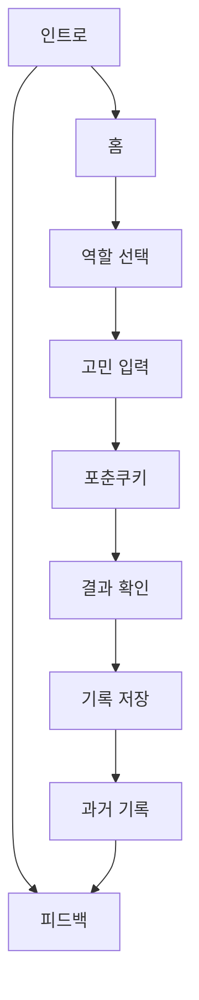

# 🥠 Frontend Change 구조 가이드

> React + Vite + TypeScript + Tailwind CSS 기반의 포춘쿠키 AI 상담 서비스

---

## 📋 목차
1. [프로젝트 개요](#-프로젝트-개요)
2. [폴더 구조](#-폴더-구조)
3. [핵심 설정 파일](#️-핵심-설정-파일)
4. [공통 컴포넌트](#-공통-컴포넌트)
5. [페이지별 상세 분석](#-페이지별-상세-분석)
6. [데이터 흐름](#-데이터-흐름)
7. [코드 품질](#-코드-품질)

---

## 🎯 프로젝트 개요

**Frontend Change**는 포춘쿠키 스타일로 AI 조언을 제공하는 상담 서비스입니다.
- **기술 스택**: React 18 + Vite + TypeScript + Tailwind CSS
- **빌드 도구**: Vite (개발서버 + 빌드)
- **스타일링**: Tailwind CSS + 커스텀 애니메이션
- **배포**: SPA 형태로 `/out` 폴더에 빌드

---

## 📁 폴더 구조

```
frontend_change/
├─ 📄 설정 파일들
│  ├─ package.json          # 의존성 관리
│  ├─ vite.config.ts        # Vite 설정
│  ├─ tailwind.config.ts    # Tailwind 설정
│  ├─ tsconfig*.json        # TypeScript 설정
│  └─ postcss.config.cjs    # PostCSS 설정
│
└─ src/
   ├─ 🚀 앱 엔트리
   │  ├─ main.tsx           # React 앱 부트스트랩
   │  ├─ App.tsx            # 전역 레이아웃 셸
   │  ├─ index.css          # 글로벌 스타일
   │  └─ supabaseClient.ts  # Supabase 클라이언트
   │
   ├─ 🔧 공용 모듈
   │  ├─ constants/         # 상수 정의
   │  ├─ types/             # 타입 정의
   │  └─ utils/             # 유틸 함수
   │
   ├─ 🎨 컴포넌트
   │  ├─ base/              # 기본 UI 컴포넌트
   │  └─ feature/           # 기능별 컴포넌트
   │
   ├─ 🪝 훅(Hooks)
   │  ├─ useApi.ts          # API 호출
   │  ├─ useAuth.ts         # 인증 관리
   │  ├─ useNavigation.ts   # 라우팅 헬퍼
   │  └─ useSessionUsage.ts # 세션 추적
   │
   ├─ 🛣️ 라우터
   │  ├─ config.tsx         # 라우트 설정
   │  └─ index.ts           # 라우터 프로바이더
   │
   └─ 📱 페이지들
      ├─ intro/             # 인트로 화면
      ├─ home/              # 홈 대시보드
      ├─ role-select/       # 역할 선택
      ├─ concern-input/     # 고민 입력
      ├─ fortune-cookie/    # 포춘쿠키 결과
      ├─ past-concerns/     # 이전 고민 기록
      ├─ feedback/          # 피드백 폼
      └─ not-found/         # 404 에러
```

---

## ⚙️ 핵심 설정 파일

### 📦 `package.json`
- **React 18** + TypeScript + Vite 기반 SPA
- **주요 의존성**: React Router, Tailwind CSS, Supabase, EmailJS
- **스크립트**: `dev` (개발), `build` (빌드), `preview` (미리보기)

### ⚡ `vite.config.ts`
- **개발서버**: Hot reload, TypeScript 지원
- **빌드 설정**: `/out` 폴더로 출력
- **SPA 모드**: 모든 라우트를 `index.html`로 처리

### 🎨 `tailwind.config.ts`
- **스캔 경로**: `src/**/*.{js,ts,jsx,tsx}` 파일 감시
- **커스텀 설정**: 확장 가능한 테마 구조

### 📝 TypeScript 설정
- **앱용**: `tsconfig.json` (엄격한 타입 체크)
- **노드용**: `tsconfig.node.json` (Vite 설정용)
- **베이스**: `tsconfig.base.json` (공통 설정)

---

## 🎨 공통 컴포넌트

### 🧱 Base 컴포넌트 (`components/base/`)

#### `Button.tsx`
```tsx
// 재사용 가능한 버튼 프리미티브
interface ButtonProps extends React.ButtonHTMLAttributes<HTMLButtonElement> {
  variant?: 'primary' | 'secondary' | 'outline'
}
```

#### `Card.tsx`
```tsx
// 박스형 컨테이너 래퍼
interface CardProps extends React.HTMLAttributes<HTMLDivElement> {
  padding?: 'sm' | 'md' | 'lg'
}
```

### 🚀 Feature 컴포넌트 (`components/feature/`)

#### `Header.tsx`
- **역할**: 전역 상단 헤더바
- **기능**: 뒤로가기, 홈 이동 버튼
- **특별 처리**: `/past-concerns`에서는 뒤로가기를 홈으로 리다이렉트

---

## 🪝 핵심 훅(Hooks)

| 훅 이름 | 역할 | 주요 기능 |
|---------|------|-----------|
| `useApi` | API 호출 래퍼 | 에러/로딩 처리 일원화 |
| `useAuth` | 인증 관리 | Supabase 기반 로그인 상태 관리 |
| `useNavigation` | 라우팅 헬퍼 | 페이지 이동 단순화 |
| `useSessionUsage` | 세션 추적 | 사용량/상태 모니터링 |

---

## 📱 페이지별 상세 분석

### 🎬 1. **인트로 페이지** (`intro/`)

**📍 역할**: 앱 첫 화면, 로그인 처리  
**📊 규모**: 46줄, 4개 컴포넌트  
**🔐 인증**: 카카오 로그인/로그아웃

#### 컴포넌트 구성
```
intro/
├─ page.tsx                 # 메인 페이지 (46줄)
├─ HamburgerMenu.tsx        # 상단 햄버거 메뉴
├─ BackgroundDecorations.tsx # 배경 그라디언트/도형
├─ FloatingIcons.tsx        # 떠다니는 아이콘 애니메이션
└─ IntroMainContent.tsx     # 메인 카피/CTA 블록
```

#### 주요 기능
- ✅ 카카오 로그인/로그아웃
- ✅ 피드백/과거기록 페이지 이동
- ✅ 시각적 인트로 효과

---

### 🏠 2. **홈 페이지** (`home/`)

**📍 역할**: 대시보드 
**📊 규모**: 8줄, 1개 컴포넌트  
**🎯 특징**: 단순 구조, 추후 확장 가능

#### 컴포넌트 구성
```
home/
├─ page.tsx           # 메인 페이지 (8줄)
└─ TemplateMessage.tsx # 홈 안내 메시지
```

---

### 🎭 3. **역할 선택 페이지** (`role-select/`)

**📍 역할**: AI 상담사 페르소나 선택  
**📊 규모**: 163줄, 5개 컴포넌트  
**🎯 선택지**: 8가지 기본 역할 + 커스텀 입력

#### 컴포넌트 구성
```
role-select/
├─ page.tsx              # 메인 페이지 (163줄)
├─ PageTitle.tsx         # 페이지 제목
├─ RoleGrid.tsx          # 역할 카드 그리드
├─ CustomRoleInput.tsx   # 커스텀 역할 입력
├─ SelectedRoleDisplay.tsx # 선택된 역할 표시
└─ NextButton.tsx        # 다음 단계 버튼
```

#### 기본 제공 역할
| 역할 | 이모지 | 설명 |
|------|-------|------|
| CEO/리더 | � | 리더십과 경영 관련 조언 |
| 디자이너 | 🎨 | 창작과 디자인 영감 |
| 개발자 | 💻 | 기술과 개발 관련 통찰 |
| 마케터 | 📈 | 마케팅과 브랜딩 전략 |
| 학생 | 📚 | 학업과 진로 상담 |
| 프리랜서 | 💼 | 독립적인 일과 자유로운 삶 |
| 부모 | ❤️ | 육아와 가족 관계 |
| 기타 | 👤 | 직접 역할을 입력해보세요 |

#### 상태 관리
- `selectedRole`: 선택된 기본 역할
- `customRole`: 사용자 입력 커스텀 역할
- `isCustom`: 커스텀 모드 여부

---

### 💭 4. **고민 입력 페이지** (`concern-input/`)

**📍 역할**: 상담 받을 고민 내용 입력  
**📊 규모**: 82줄, 5개 컴포넌트  
**📝 제한**: 최대 100자

#### 컴포넌트 구성
```
concern-input/
├─ page.tsx               # 메인 페이지 (82줄)
├─ PageTitle.tsx          # 페이지 제목
├─ SelectedRoleDisplay.tsx # 선택된 역할 표시
├─ ConcernInputArea.tsx   # 고민 입력 텍스트 영역
├─ SuggestedConcerns.tsx  # 추천 고민 예시
└─ SubmitButton.tsx       # 제출 버튼
```

#### 상태 관리
- `concern`: 고민 내용 (최대 100자)
- `isSubmitting`: 제출 중 상태
- `charCount`: 실시간 글자수 카운트

#### 제출 플로우
1. 고민 내용 검증 (빈값/길이 체크)
2. 로딩 상태 표시
3. `fortune-cookie` 페이지로 데이터 전달

---

### 🥠 5. **포춘쿠키 페이지** (`fortune-cookie/`)

**📍 역할**: 쿠키 애니메이션 + AI 답변 표시  
**📊 규모**: 233줄, 6개 컴포넌트  
**🎭 핵심**: 포춘쿠키 열기 연출 + 결과 공유

#### 컴포넌트 구성
```
fortune-cookie/
├─ page.tsx                # 메인 페이지 (233줄)
├─ RoleInfoDisplay.tsx     # 역할 정보 표시
├─ CookieAnimationArea.tsx # 애니메이션 제어 영역
├─ FortuneCookie.tsx       # 쿠키 그래픽/애니메이션
└─ FortuneResultDisplay.tsx # AI 답변 텍스트 표시
```

> **참고**: ShareButtons.tsx와 ActionButtons.tsx는 코드에 존재하지만 실제로는 사용되지 않습니다.

#### 애니메이션 플로우
1. **쿠키 대기** → 클릭 유도
2. **쿠키 열기** → 크랙 애니메이션
3. **답변 공개** → 페이드인 효과

#### API 연동
- **백엔드**: `useApi` 훅으로 AI 답변 요청
- **저장**: Supabase에 상담 기록 저장
- **히스토리**: localStorage에 최대 50개 보관

#### 외부 SDK
- **카카오**: 공유 기능 (SDK 로드)
- **클립보드**: 링크 복사 기능

#### 상태 관리
- `isOpening`: 쿠키 열기 중
- `isOpened`: 쿠키 열림 완료
- `showFortune`: 답변 표시 여부
- `fortuneMessage`: AI 답변 텍스트
- `isSharing`: 공유 진행 중

---

### 📄 6. **이전 고민 페이지** (`past-concerns/`)

**📍 역할**: 과거 상담 기록 조회/관리  
**📊 규모**: 503줄, 12개 컴포넌트  
**🎯 특징**: 가장 복잡한 페이지, 전문가급 분리

#### 컴포넌트 구성
```
past-concerns/
├─ page.tsx                 # 메인 페이지 (503줄)
├─ PageHeader.tsx           # 페이지 헤더
├─ LoginPrompt.tsx          # 로그인 안내
├─ LoadingState.tsx         # 로딩 상태 UI
├─ EmptyState.tsx           # 빈 상태 UI
├─ StatisticsCards.tsx      # 통계 카드 4개
├─ FilterAndSearchBar.tsx   # 검색/필터/정렬 바
├─ ActiveFilters.tsx        # 활성 필터 표시
├─ PastConcernCard.tsx      # 개별 기록 카드
├─ PastConcernGrid.tsx      # 그리드/리스트 컨테이너
├─ DetailModal.tsx          # 상세보기 모달
├─ DeleteConfirmModal.tsx   # 삭제 확인 모달
└─ Pagination.tsx           # 페이지네이션
```

#### 통계 카드 (StatisticsCards.tsx)
| 카드 | 내용 | 계산 방식 |
|------|------|-----------|
| 📊 총 운세 | 전체 상담 횟수 | 총 기록 수 |
| 🎭 상담 역할 | 사용한 역할 종류 | 고유 역할 수 |
| 📅 최근 7일 | 일주일간 활동 | 날짜 필터링 |
| 📈 주 평균 | 주당 평균 상담 | 통계 계산 |

#### 고급 기능
- ✅ **검색**: 고민/답변 내용 텍스트 검색
- ✅ **필터**: 역할별, 날짜 범위 필터링
- ✅ **정렬**: 최신순, 오래된순
- ✅ **뷰 모드**: 그리드/리스트 전환
- ✅ **페이지네이션**: 페이지별 데이터 로드
- ✅ **모달**: 상세보기, 삭제 확인

#### 데이터 소스
1. **Primary**: Supabase (로그인 사용자의 영구 저장)
2. **Backup**: localStorage (fortune-cookie 페이지에서 백업용으로만 사용)

> **localStorage 사용 이유**: 
> - fortune-cookie 페이지에서 Supabase 저장 **후에 추가로** localStorage에도 백업 저장
> - 최대 50개 기록 보관으로 용량 관리
> - past-concerns 페이지는 **오직 Supabase 데이터만** 사용 (로그인 필수)
> - 로그인하지 않으면 과거 기록을 볼 수 없음

#### 복잡한 상태 관리 (15개+)
```typescript
// 데이터 상태
const [history, setHistory] = useState([])
const [filteredHistory, setFilteredHistory] = useState([])
const [statistics, setStatistics] = useState({})

// UI 상태  
const [isLoading, setIsLoading] = useState(true)
const [viewMode, setViewMode] = useState('grid')
const [searchTerm, setSearchTerm] = useState('')

// 필터 상태
const [selectedRole, setSelectedRole] = useState('')  
const [dateRange, setDateRange] = useState({})

// 모달 상태
const [detailModal, setDetailModal] = useState({})
const [deleteModal, setDeleteModal] = useState({})

// 페이지네이션
const [currentPage, setCurrentPage] = useState(1)
const [itemsPerPage] = useState(12)
```

---

### 📝 7. **피드백 페이지** (`feedback/`)

**📍 역할**: 사용자 피드백 수집  
**📊 규모**: 147줄, 9개 컴포넌트  
**📧 전송**: EmailJS 활용

#### 컴포넌트 구성
```
feedback/
├─ page.tsx            # 메인 페이지 (147줄)
├─ PageTitle.tsx       # 페이지 제목
├─ LoadingState.tsx    # 로딩 상태
├─ LoginRequired.tsx   # 로그인 필수 안내
├─ SubmissionSuccess.tsx # 전송 완료 안내
├─ FeedbackType.tsx    # 피드백 유형 선택
├─ Rating.tsx          # 별점 평가 (1~5점)
├─ MessageInput.tsx    # 피드백 본문 (500자 제한)
├─ EmailInput.tsx      # 연락처 (선택사항)
└─ SubmitButtons.tsx   # 제출/취소 버튼
```

#### 피드백 유형 (FeedbackType.tsx)
```
┌─────────────┬─────────────┐
│ 💡 개선제안  │ 🐛 버그신고  │
├─────────────┼─────────────┤  
│ ❤️ 칭찬     │ 💬 기타     │
└─────────────┴─────────────┘
```

#### 평점 시스템 (Rating.tsx)
- ⭐ 1~5점 별점 클릭 선택
- hover/active 시 amber 색상 피드백
- 필수 입력 항목

#### 폼 검증
- **필수**: 유형, 평점, 메시지 (500자 제한)
- **선택**: 이메일 (답변 필요시)
- **실시간**: 글자수 카운터

#### 전송 플로우
1. 로그인 상태 확인 (Supabase)
2. 폼 검증 (필수값 체크)
3. EmailJS로 이메일 전송
4. 성공 페이지 표시

---

### ❌ 8. **404 에러 페이지** (`not-found/`)

**📍 역할**: 잘못된 URL 처리  
**📊 규모**: 18줄, 2개 컴포넌트  
**🎯 기능**: 단순 에러 안내 + 내비게이션

#### 컴포넌트 구성
```
not-found/
├─ page.tsx             # 메인 페이지 (18줄)
├─ ErrorMessage.tsx     # 에러 안내 메시지
└─ NavigationButtons.tsx # 홈/뒤로가기 버튼
```

---

## 🔄 데이터 흐름

### 전체 사용자 여정

```mermaid
flowchart TD
    A[인트로] --> B[홈]
    B --> C[역할 선택]
    C --> D[고민 입력]
    D --> E[포춘쿠키]
    E --> F[결과 확인]
    F --> G[기록 저장]
    G --> H[과거 기록]
    
    A --> I[피드백]
    H --> I
```

### API 통신 구조
```
프론트엔드 → 백엔드 API → AI 서비스
     ↓           ↓
 Supabase ← 기록 저장
     ↓
localStorage (백업)
```

### 주요 데이터 저장소
| 저장소 | 용도 | 데이터 |
|--------|------|--------|
| **Supabase** | 메인 DB | 사용자별 상담 기록 (인증 필요) |
| **localStorage** | 로컬 백업 | 백업 기록 (최대 50개) |
| **React State** | 임시 상태 | 페이지간 데이터 전달 (location.state) |

