# 🥠 Frontend Change 구조 가이드

> React + Vite + TypeScript + Tailwind CSS 기반의 포춘쿠키 AI 상담 서비스

---

## 📋 목차
1. [프로젝트 개요](#-프로젝트-개요)
2. [폴더 구조](#-폴더-구조)
3. [핵심 설정 파일](#️-핵심-설정-파일)
4. [공통 컴포넌트](#-공통-컴포넌트)
5. [페이지별 상세 분석](#-페이지별-상세-분석)
6. [일일 사용 제한 시스템](#-일일-사용-제한-시스템)
7. [데이터 흐름](#-데이터-흐름)
8. [코드 품질](#-코드-품질)

---

## 🎯 프로젝트 개요

**Frontend Change**는 포춘쿠키 스타일로 AI 조언을 제공하는 상담 서비스입니다.
- **기술 스택**: React 18 + Vite + TypeScript + Tailwind CSS
- **빌드 도구**: Vite (개발서버 + 빌드)
- **스타일링**: Tailwind CSS + 커스텀 애니메이션
- **배포**: SPA 형태로 `/out` 폴더에 빌드

---

## 📁 폴더 구조

```
frontend_change/
├─ 📄 설정 파일들
│  ├─ package.json          # 의존성 관리
│  ├─ vite.config.ts        # Vite 설정
│  ├─ tailwind.config.ts    # Tailwind 설정
│  ├─ tsconfig*.json        # TypeScript 설정
│  └─ postcss.config.cjs    # PostCSS 설정
│
└─ src/
   ├─ 🚀 앱 엔트리
   │  ├─ main.tsx           # React 앱 부트스트랩
   │  ├─ App.tsx            # 전역 레이아웃 셸
   │  ├─ index.css          # 글로벌 스타일
   │  └─ supabaseClient.ts  # Supabase 클라이언트
   │
   ├─ 🔧 공용 모듈
   │  ├─ constants/         # 상수 정의
   │  ├─ types/             # 타입 정의
   │  └─ utils/             # 유틸 함수
   │
   ├─ 🎨 컴포넌트
   │  ├─ base/              # 기본 UI 컴포넌트
   │  └─ feature/           # 기능별 컴포넌트
   │
   ├─ 🪝 훅(Hooks)
   │  ├─ useApi.ts          # API 호출
   │  ├─ useAuth.ts         # 인증 관리
   │  └─ useSessionUsage.ts # 세션 추적
   │
   ├─ 🛣️ 라우터
   │  ├─ config.tsx         # 라우트 설정
   │  └─ index.ts           # 라우터 프로바이더
   │
   └─ 📱 페이지들
      ├─ intro/             # 인트로 화면
      ├─ school-select/     # 학교 선택
      ├─ role-select/       # 역할 선택
      ├─ concern-input/     # 고민 입력
      ├─ fortune-cookie/    # 포춘쿠키 결과
      ├─ past-concerns/     # 이전 고민 기록
      ├─ feedback/          # 피드백 폼
      ├─ settings/          # 설정
      ├─ admin/             # 관리자 대시보드
      ├─ account-banned/    # 계정 밴 안내
      ├─ account-cooldown/  # 재가입 제한 안내
      ├─ account-deleted/   # 계정 삭제 완료
      ├─ oauth-callback/   # OAuth 콜백
      ├─ auth-callback/     # 인증 콜백
      └─ not-found/         # 404 에러
```

---

## ⚙️ 핵심 설정 파일

### 📦 `package.json`
- **React 18** + TypeScript + Vite 기반 SPA
- **주요 의존성**: React Router, Tailwind CSS, Supabase, EmailJS
- **스크립트**: `dev` (개발), `build` (빌드), `preview` (미리보기)

### ⚡ `vite.config.ts`
- **개발서버**: 포트 3000, Hot reload, TypeScript 지원
- **빌드 설정**: `/out` 폴더로 출력
- **SPA 모드**: 모든 라우트를 `index.html`로 처리
- **프록시**: `/api` 요청을 `http://localhost:4000`으로 프록시

### 🎨 `tailwind.config.ts`
- **스캔 경로**: `src/**/*.{js,ts,jsx,tsx}` 파일 감시
- **커스텀 설정**: 확장 가능한 테마 구조

### 📝 TypeScript 설정
- **앱용**: `tsconfig.json` (엄격한 타입 체크)
- **노드용**: `tsconfig.node.json` (Vite 설정용)
- **베이스**: `tsconfig.base.json` (공통 설정)

---

## 🎨 공통 컴포넌트

### 🧱 Base 컴포넌트 (`components/base/`)

#### `Button.tsx`
```tsx
// 재사용 가능한 버튼 프리미티브
interface ButtonProps extends React.ButtonHTMLAttributes<HTMLButtonElement> {
  variant?: 'primary' | 'secondary' | 'outline'
}
```

#### `Card.tsx`
```tsx
// 박스형 컨테이너 래퍼
interface CardProps extends React.HTMLAttributes<HTMLDivElement> {
  padding?: 'sm' | 'md' | 'lg'
}
```

### 🚀 Feature 컴포넌트 (`components/feature/`)

#### `Header.tsx`
- **역할**: 전역 상단 헤더바
- **기능**: 뒤로가기, 홈 이동 버튼
- **특별 처리**: `/past-concerns`에서는 뒤로가기를 홈으로 리다이렉트

---

## 🪝 핵심 훅(Hooks)

| 훅 이름 | 역할 | 주요 기능 |
|---------|------|-----------|
| `useApi` | API 호출 래퍼 | 에러/로딩 처리 일원화 |
| `useAuth` | 인증 관리 | Supabase 기반 로그인 상태 관리 |
| `useSessionUsage` | 세션 추적 | 사용량/상태 모니터링 |

---

## 📱 페이지별 상세 분석

### 🎬 1. **인트로 페이지** (`intro/`)

**📍 역할**: 앱 첫 화면, 로그인 처리  
**📊 규모**: 46줄, 4개 컴포넌트  
**🔐 인증**: 카카오 로그인/로그아웃

#### 컴포넌트 구성
```
intro/
├─ page.tsx                 # 메인 페이지 (46줄)
├─ HamburgerMenu.tsx        # 상단 햄버거 메뉴
├─ BackgroundDecorations.tsx # 배경 그라디언트/도형
├─ FloatingIcons.tsx        # 떠다니는 아이콘 애니메이션
└─ IntroMainContent.tsx     # 메인 카피/CTA 블록
```

#### 주요 기능
- ✅ 카카오 로그인/로그아웃
- ✅ 피드백/과거기록 페이지 이동
- ✅ 시각적 인트로 효과

---

### 🎭 2. **역할 선택 페이지** (`role-select/`)

**📍 역할**: AI 상담사 페르소나 선택  
**📊 규모**: 422줄, 5개 컴포넌트  
**🎯 선택지**: 기본 역할 1개 (학생) + 커스텀 역할 추가 가능

#### 컴포넌트 구성
```
role-select/
├─ page.tsx              # 메인 페이지 (422줄)
├─ PageTitle.tsx         # 페이지 제목
├─ RoleGrid.tsx          # 역할 카드 그리드
├─ CustomRoleInput.tsx   # 커스텀 역할 입력
├─ SelectedRoleDisplay.tsx # 선택된 역할 표시
└─ NextButton.tsx        # 다음 단계 버튼
```

#### 기본 제공 역할
| 역할 | 아이콘 | 설명 |
|------|-------|------|
| 학생 | 📚 (ri-book-line) | 학업과 진로 상담 |

**참고**: 기본 제공 역할은 '학생' 1개만 있으며, 나머지 역할은 사용자가 커스텀 역할로 추가할 수 있습니다. 커스텀 역할은 백엔드 `custom_roles` 테이블에 저장되며, 사용자별로 관리됩니다.

#### 상태 관리
- `selectedRole`: 선택된 기본 역할
- `customRole`: 사용자 입력 커스텀 역할
- `isCustom`: 커스텀 모드 여부

---

### 💭 3. **고민 입력 페이지** (`concern-input/`)

**📍 역할**: 상담 받을 고민 내용 입력  
**📊 규모**: 82줄, 5개 컴포넌트  
**📝 제한**: 최대 100자

#### 컴포넌트 구성
```
concern-input/
├─ page.tsx               # 메인 페이지 (82줄)
├─ PageTitle.tsx          # 페이지 제목
├─ SelectedRoleDisplay.tsx # 선택된 역할 표시
├─ ConcernInputArea.tsx   # 고민 입력 텍스트 영역
├─ SuggestedConcerns.tsx  # 추천 고민 예시
└─ SubmitButton.tsx       # 제출 버튼
```

#### 상태 관리
- `concern`: 고민 내용 (최대 100자)
- `isSubmitting`: 제출 중 상태
- `charCount`: 실시간 글자수 카운트

#### 제출 플로우
1. 고민 내용 검증 (빈값/길이 체크)
2. 로딩 상태 표시
3. `fortune-cookie` 페이지로 데이터 전달

---

### 🥠 4. **포춘쿠키 페이지** (`fortune-cookie/`)

**📍 역할**: 쿠키 애니메이션 + AI 답변 표시  
**📊 규모**: 233줄, 6개 컴포넌트  
**🎭 핵심**: 포춘쿠키 열기 연출 + 결과 공유

#### 컴포넌트 구성
```
fortune-cookie/
├─ page.tsx                # 메인 페이지 (233줄)
├─ RoleInfoDisplay.tsx     # 역할 정보 표시
├─ CookieAnimationArea.tsx # 애니메이션 제어 영역
├─ FortuneCookie.tsx       # 쿠키 그래픽/애니메이션
└─ FortuneResultDisplay.tsx # AI 답변 텍스트 표시
```

> **참고**: ShareButtons.tsx와 ActionButtons.tsx는 코드에 존재하지만 실제로는 사용되지 않습니다.

#### 애니메이션 플로우
1. **쿠키 대기** → 클릭 유도
2. **쿠키 열기** → 크랙 애니메이션
3. **답변 공개** → 페이드인 효과

#### API 연동
- **백엔드**: `useApi` 훅으로 AI 답변 요청
- **저장**: Supabase에 상담 기록 저장
- **히스토리**: localStorage에 최대 50개 보관

#### 외부 SDK
- **카카오**: 공유 기능 (SDK 로드)
- **클립보드**: 링크 복사 기능

#### 상태 관리
- `isOpening`: 쿠키 열기 중
- `isOpened`: 쿠키 열림 완료
- `showFortune`: 답변 표시 여부
- `fortuneMessage`: AI 답변 텍스트
- `isSharing`: 공유 진행 중

---

### 📄 5. **이전 고민 페이지** (`past-concerns/`)

**📍 역할**: 과거 상담 기록 조회/관리  
**📊 규모**: 503줄, 12개 컴포넌트  
**🎯 특징**: 가장 복잡한 페이지, 전문가급 분리

#### 컴포넌트 구성
```
past-concerns/
├─ page.tsx                 # 메인 페이지 (503줄)
├─ PageHeader.tsx           # 페이지 헤더
├─ LoginPrompt.tsx          # 로그인 안내
├─ LoadingState.tsx         # 로딩 상태 UI
├─ EmptyState.tsx           # 빈 상태 UI
├─ StatisticsCards.tsx      # 통계 카드 4개
├─ FilterAndSearchBar.tsx   # 검색/필터/정렬 바
├─ ActiveFilters.tsx        # 활성 필터 표시
├─ PastConcernCard.tsx      # 개별 기록 카드
├─ PastConcernGrid.tsx      # 그리드/리스트 컨테이너
├─ DetailModal.tsx          # 상세보기 모달
├─ DeleteConfirmModal.tsx   # 삭제 확인 모달
└─ Pagination.tsx           # 페이지네이션
```

#### 통계 카드 (StatisticsCards.tsx)
| 카드 | 내용 | 계산 방식 |
|------|------|-----------|
| 📊 총 운세 | 전체 상담 횟수 | 총 기록 수 |
| 🎭 상담 역할 | 사용한 역할 종류 | 고유 역할 수 |
| 📅 최근 7일 | 일주일간 활동 | 날짜 필터링 |
| 📈 주 평균 | 주당 평균 상담 | 통계 계산 |

#### 고급 기능
- ✅ **검색**: 고민/답변 내용 텍스트 검색
- ✅ **필터**: 역할별, 날짜 범위 필터링
- ✅ **정렬**: 최신순, 오래된순
- ✅ **뷰 모드**: 그리드/리스트 전환
- ✅ **페이지네이션**: 페이지별 데이터 로드
- ✅ **모달**: 상세보기, 삭제 확인

#### 데이터 소스
1. **Primary**: Supabase (로그인 사용자의 영구 저장)
2. **Backup**: localStorage (fortune-cookie 페이지에서 백업용으로만 사용)

> **localStorage 사용 이유**: 
> - fortune-cookie 페이지에서 Supabase 저장 **후에 추가로** localStorage에도 백업 저장
> - 최대 50개 기록 보관으로 용량 관리
> - past-concerns 페이지는 **오직 Supabase 데이터만** 사용 (로그인 필수)
> - 로그인하지 않으면 과거 기록을 볼 수 없음

#### 복잡한 상태 관리 (15개+)
```typescript
// 데이터 상태
const [history, setHistory] = useState([])
const [filteredHistory, setFilteredHistory] = useState([])
const [statistics, setStatistics] = useState({})

// UI 상태  
const [isLoading, setIsLoading] = useState(true)
const [viewMode, setViewMode] = useState('grid')
const [searchTerm, setSearchTerm] = useState('')

// 필터 상태
const [selectedRole, setSelectedRole] = useState('')  
const [dateRange, setDateRange] = useState({})

// 모달 상태
const [detailModal, setDetailModal] = useState({})
const [deleteModal, setDeleteModal] = useState({})

// 페이지네이션
const [currentPage, setCurrentPage] = useState(1)
const [itemsPerPage] = useState(12)
```

---

### 📝 6. **피드백 페이지** (`feedback/`)

**📍 역할**: 사용자 피드백 수집  
**📊 규모**: 147줄, 9개 컴포넌트  
**📧 전송**: EmailJS 활용

#### 컴포넌트 구성
```
feedback/
├─ page.tsx            # 메인 페이지 (147줄)
├─ PageTitle.tsx       # 페이지 제목
├─ LoadingState.tsx    # 로딩 상태
├─ LoginRequired.tsx    # 로그인 필수 안내
├─ SubmissionSuccess.tsx # 전송 완료 안내
├─ FeedbackType.tsx    # 피드백 유형 선택
├─ Rating.tsx           # 별점 평가 (1~5점)
├─ MessageInput.tsx    # 피드백 본문 (500자 제한)
├─ EmailInput.tsx      # 연락처 (선택사항)
└─ SubmitButtons.tsx   # 제출/취소 버튼
```

#### 피드백 유형 (FeedbackType.tsx)
```
┌─────────────┬─────────────┐
│ 💡 개선제안  │ 🐛 버그신고  │
├─────────────┼─────────────┤  
│ ❤️ 칭찬     │ 💬 기타     │
└─────────────┴─────────────┘
```

#### 평점 시스템 (Rating.tsx)
- ⭐ 1~5점 별점 클릭 선택
- hover/active 시 amber 색상 피드백
- 필수 입력 항목

#### 폼 검증
- **필수**: 유형, 평점, 메시지 (500자 제한)
- **선택**: 이메일 (답변 필요시)
- **실시간**: 글자수 카운터

#### 전송 플로우
1. 로그인 상태 확인 (Supabase)
2. 폼 검증 (필수값 체크)
3. EmailJS로 이메일 전송
4. 성공 페이지 표시

---

### ❌ 7. **404 에러 페이지** (`not-found/`)

**📍 역할**: 잘못된 URL 처리  
**📊 규모**: 18줄, 2개 컴포넌트  
**🎯 기능**: 단순 에러 안내 + 내비게이션

#### 컴포넌트 구성
```
not-found/
├─ page.tsx             # 메인 페이지 (18줄)
├─ ErrorMessage.tsx     # 에러 안내 메시지
└─ NavigationButtons.tsx # 홈/뒤로가기 버튼
```

---

## 📊 일일 사용 제한 시스템

### 📋 **개요**
- 사용자가 하루에 한 번만 포춘쿠키를 받을 수 있도록 제한
- 역할 선택 페이지에서 사용 여부 체크 및 제한 처리

### 🎯 **주요 파일**
- **페이지**: `frontend_change/src/pages/role-select/page.tsx`
- **API 호출**: `/api/access-control/check-full-access` 엔드포인트 사용
- **접근 제어**: `frontend_change/src/pages/intro/components/IntroMainContent.tsx`에서도 동일 API 사용

### 🔄 **동작 흐름**

#### 1️⃣ **페이지 진입 시 체크**
```typescript
// 접근 권한 및 일일 사용 제한 확인
const response = await apiFetch(`/api/access-control/check-full-access`);
const data = await response.json();

if (!data.canAccess) {
  // 접근 불가 화면 표시 (밴 상태, 학교 정보 없음, 기간 외 등)
}

if (!data.canUse) {
  // 일일 사용 제한 화면 표시
}
```

#### 2️⃣ **차단 화면 표시**
```jsx
// 접근 불가 또는 일일 사용 제한에 걸린 경우
if (!data.canAccess) {
  // AccessModal 컴포넌트로 접근 불가 안내
  // - 밴 상태: account-banned 페이지로 리다이렉트
  // - 학교 정보 없음: school-select 페이지로 리다이렉트
  // - 기간 외: 경고 메시지 표시
}

if (!data.canUse) {
  // AccessModal 컴포넌트로 일일 사용 제한 안내
  // - "오늘의 포춘쿠키를 이미 받으셨어요!" 메시지
  // - 다음 이용 가능 시간 카운트다운 표시
}
```

#### 3️⃣ **사용 기록 생성**
```typescript
// 포춘쿠키 페이지에서 결과 표시 시 자동 생성
const response = await apiFetch('/api/daily-usage-logs', {
  method: 'POST',
  headers: { 'Content-Type': 'application/json' },
  body: JSON.stringify({ userId: user.id }),
});
```

### ⚙️ **테스트 설정**
**현재 상태**: 테스트용 (1분 제한) ⚡
- 1분 후 다시 사용 가능  
- 백엔드에서 제한 시간 설정 변경 가능

**운영 전환**: `backend/src/services/accessControlService.js`에서 주석 변경

### 🛡️ **회원탈퇴 시 재가입 제한 정책**

#### 📋 **정책 개요**
- **회원탈퇴 시 `deletion_restrictions` 테이블에 해시값만 저장**
- 이메일, User-Agent, IP 주소를 SHA-256 해시로 변환하여 저장 (개인정보 없음)
- 탈퇴 후 같은 계정으로 재가입 시에도 24시간 동안 제한 유지
- 24시간 후 자동 스케줄러에 의해 해시 정보 삭제

#### 🔐 **해시화 방식**
- **이메일**: SHA-256 해시 (64자)
- **User-Agent**: SHA-256 해시 (브라우저 핑거프린트)
- **IP 주소**: SHA-256 해시
- **개인정보 보호**: 원본 데이터는 저장하지 않고 해시값만 저장

#### 🔄 **동작 시나리오**
1. **사용자 A**: 포춘쿠키 사용 → 일일 제한 적용
2. **회원탈퇴**: 계정 삭제, `daily_usage_log`는 즉시 삭제
3. **해시 저장**: `deletion_restrictions` 테이블에 해시값 저장 (24시간 유효)
4. **재가입**: 같은 계정으로 재가입 시도
5. **제한 유지**: 24시간 경과 전까지 사용 불가 (해시값으로 확인)

#### ⚠️ **중요 사항**
- 회원탈퇴로 일일 제한을 우회할 수 없음
- `daily_usage_log`는 회원탈퇴 시 즉시 삭제됨
- 재가입 제한은 `deletion_restrictions` 테이블의 해시값으로 관리됨
- 해시 정보는 자동 스케줄러에 의해 24시간 후 삭제 (운영용)

---

## 🏫 학교별 날짜 제한 시스템

### 📋 **관리자 기능**
- **관리자 대시보드** → **설정 탭**에서 학교별 이용 기간 설정
- 24개 대학교 데이터 검색 및 선택 가능
- 시작일/종료일 설정으로 정확한 이용 기간 관리

### 🎯 **학교 데이터**
- **위치**: `frontend_change/src/data/schools.json`
- **포함 학교**: 서울/경기/인천 주요 대학교 24개
- **검색 기능**: 학교명, 지역별 검색 지원

### 🔄 **접근 제어 흐름**
1. **사용자 로그인** → 2. **인트로 페이지에서 접근 권한 체크** (`/api/access-control/check-full-access`)
2. **결과에 따른 화면 분기**:
   - ✅ **접근 가능 + 사용 가능**: 정상 화면 (역할 선택 페이지 등)
   - ⚠️ **접근 가능 + 사용 불가**: AccessModal로 "오늘의 포춘쿠키를 이미 받으셨어요!" 표시
   - ❌ **접근 불가**: 
     - 밴 상태 → `/account-banned` 페이지로 리다이렉트
     - 학교 정보 없음 → `/school-select` 페이지로 리다이렉트
     - 기간 외 → AccessModal로 경고 메시지 표시
     - 재가입 제한 → `/account-cooldown` 페이지로 리다이렉트

### 📊 **체크 우선순위**
1. **🚫 밴 상태** (최우선)
2. **🏫 학교 정보** 존재 여부
3. **📅 학교 이용 기간** 범위 내
4. **⏰ 일일 사용 제한** (학교별)

---

## 🔄 데이터 흐름

### 일일 제한이 적용된 사용자 여정

```mermaid
flowchart TD
    A[인트로] --> B{접근 권한 체크}
    B -->|접근 불가| C[차단 화면/리다이렉트]
    B -->|접근 가능| D{일일 사용 여부}
    D -->|첫 사용| E[역할 선택]
    D -->|이미 사용| F[일일 제한 안내]
    E --> G[고민 입력]
    G --> H[포춘쿠키]
    H --> I[결과 확인]
    I --> J[기록 저장 + 사용로그]
    J --> K[과거 기록]
    F --> K
    C --> A
    
    A --> L[피드백]
    K --> L
```


### 기본 사용자 여정 (제한 없음)

```mermaid
flowchart TD
    A[인트로] --> B{접근 권한 체크}
    B -->|접근 불가| C[차단 화면/리다이렉트]
    B -->|접근 가능| D[역할 선택]
    D --> E[고민 입력]
    E --> F[포춘쿠키]
    F --> G[결과 확인]
    G --> H[기록 저장]
    H --> I[과거 기록]
    C --> A
    
    A --> J[피드백]
    I --> J
```


### API 통신 구조
```
프론트엔드 → 백엔드 API → AI 서비스
     ↓           ↓
 Supabase ← 기록 저장
     ↓
localStorage (백업)
```

### 주요 데이터 저장소
| 저장소 | 용도 | 데이터 |
|--------|------|--------|
| **Supabase** | 메인 DB | 사용자별 상담 기록 (인증 필요) |
| **localStorage** | 로컬 백업 | 백업 기록 (최대 50개) |
| **React State** | 임시 상태 | 페이지간 데이터 전달 (location.state) |

---

## 🔧 짧은 AI 조언 시스템 (주석처리됨)

### 📋 **현재 상태**
- **위치**: `frontend_change/src/pages/fortune-cookie/page.tsx` (55-85줄)
- **상태**: 주석처리됨 (JSON 파일로 대체)
- **데이터 소스**: `frontend_change/public/data/short-advices.json`

> 백엔드 변경 반영: `POST /api/concerns/ai/both` 응답에서 `shortAdvice`는 이제 빈 문자열로 반환됩니다. 프런트 표시 로직에는 영향이 없습니다.

### 🔄 **복원 방법**

#### 1️⃣ **주석 해제**
`frontend_change/src/pages/fortune-cookie/page.tsx` 파일에서 다음 부분의 주석을 해제:

```typescript
// 주석 해제할 부분 (60-65줄)
const { data } = await getAiBothAdvices(selectedRole.name, concern);
const shortAdvice = data?.shortAdvice || data?.message || "운세를 받지 못했습니다. 다시 시도해 주세요.";
const longAdviceText = data?.longAdvice || "긴 조언을 받지 못했습니다.";
setFortuneMessage(shortAdvice);
setLongAdvice(longAdviceText);
```

#### 2️⃣ **JSON 파일 로직 제거**
다음 부분을 주석처리하거나 삭제:

```typescript
// 제거할 부분 (79-93줄)
const response = await fetch('/data/short-advices.json');
const advicesData = await response.json();
const randomIndex = Math.floor(Math.random() * advicesData.advices.length);
const randomAdvice = advicesData.advices[randomIndex];
setFortuneMessage(randomAdvice.text);
```

#### 3️⃣ **긴 조언 API 호출 정리**
중복된 API 호출을 하나로 통합:

```typescript
// 통합된 형태
const { data } = await getAiBothAdvices(selectedRole.name, concern);
const shortAdvice = data?.shortAdvice || data?.message || "운세를 받지 못했습니다. 다시 시도해 주세요.";
const longAdviceText = data?.longAdvice || "긴 조언을 받지 못했습니다.";
setFortuneMessage(shortAdvice);
setLongAdvice(longAdviceText);
```

### 📊 **JSON 데이터 구조**
현재 사용 중인 JSON 파일 (`public/data/short-advices.json`):

```json
{
  "advices": [
    {
      "id": 1,
      "text": "행동으로 옮기면 상황이 나아질 거예요"
    },
    {
      "id": 2,
      "text": "신중하게 생각해볼 필요가 있어요"
    },
    {
      "id": 3,
      "text": "주변 사람들과의 소통이 예상치 못한 기회를 만들어낼 것입니다."
    }
  ]
}
```

### ⚙️ **현재 동작 방식**
1. **JSON 파일 로드**: `/data/short-advices.json`에서 조언 목록 가져오기
2. **랜덤 선택**: `Math.random()`으로 조언 목록 중 하나 선택
3. **표시**: 선택된 조언의 `text` 필드를 포춘쿠키 메시지로 표시
4. **긴 조언**: `FortuneResultDisplay` 컴포넌트에서 별도로 AI 백엔드 API 호출
